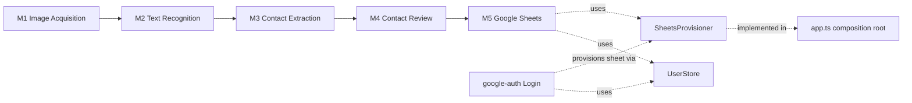
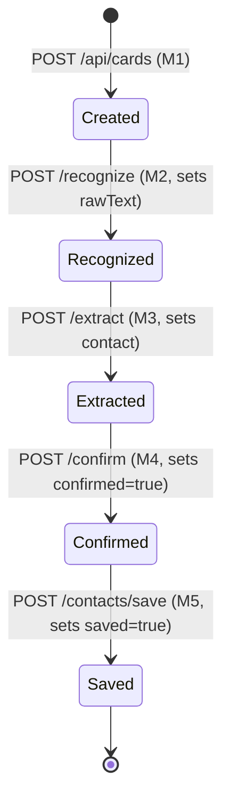

# Architecture & Cross-Cutting Decisions

This document records implementation-level decisions that apply across modules,
filling gaps the module docs intentionally left unspecified (tech stack, session
storage, error conventions). Module-specific decisions live in each module's own
"Implementation Notes" section under `docs/modules/`.

## Structure

```
card2contact/
├── docs/                  # Single source of truth for requirements
├── backend/               # Node.js + TypeScript + Express modular monolith
│   └── src/
│       ├── shared/        # Cross-module contracts ONLY:
│       │                  #   types, stores (card-session, user), token-codec,
│       │                  #   db (pool/init), http (session, errors), sheets (provisioner)
│       └── modules/       # One folder per doc module:
│                          #   image-acquisition (M1), text-recognition (M2),
│                          #   contact-extraction (M3), contact-review (M4),
│                          #   google-sheets (M5) + google-auth (login)
├── frontend/              # React + TypeScript, API-driven, no business logic
└── (postgres via docker-compose — multi-user persistence)
```

## Tech stack

- **Backend**: Node.js, TypeScript, Express.
- **Frontend**: React + TypeScript (Vite), calls the backend only via `fetch` (with `credentials: "include"` so the session cookie rides along).
- **OCR provider**: Mistral (`@mistralai/mistralai`), per M2.
- **Sheets/auth**: `googleapis` + `google-auth-library`, per M5.
- **Persistence**: Postgres (`pg`) for the multi-user `users` table; session cookies via `cookie-parser`. Unit tests via `vitest`.

## Module boundary rule

Each module folder under `backend/src/modules/` is named for what it does
(`image-acquisition`, `text-recognition`, `contact-extraction`,
`contact-review`, `google-sheets` — mapping 1:1 to M1–M5) and exposes a
`<name>.service.ts` (business rules) and `<name>.router.ts` (HTTP wiring); a
module with an external provider also gets a `<name>.client.ts` isolating that
SDK (`text-recognition.client.ts` for Mistral, `google-sheets.client.ts` for
Google Sheets). A module never imports another module's service or router
directly — the inter-module contracts are the shared `CardSessionStore`,
`UserStore`, and `SheetsProvisioner` interfaces in `backend/src/shared/`. The
`SheetsProvisioner` interface exists specifically so google-auth can provision a
user's sheet without importing google-sheets; `app.ts` (the composition root)
supplies the implementation.



Pipeline modules (M1–M5) depend only on the previous stage's output via
`CardSessionStore`; M5 and google-auth additionally depend on the shared
`UserStore` and `SheetsProvisioner` — never on each other directly.

## Session state (M1 → M4 handoff)

The docs describe card/image/text/contact state as held "in-session," with no
database anywhere except the final Google Sheets write (M5). This is
implemented as a single process-wide in-memory store:

- `backend/src/shared/types/card-session.ts` — the `CardSession` record shape.
  Each field is commented with which module owns it.
- `backend/src/shared/store/card-session-store.ts` — `CardSessionStore`
  interface + `InMemoryCardSessionStore` implementation, keyed by `cardId`.
  This is the only way modules read or write pipeline state.
- Card/OCR/contact state does not survive a server restart — acceptable, as it
  is transient per-scan working state.



`PATCH /api/cards/{cardId}/contact` (M4) edits `contact` without advancing
state — see [M4's Implementation Notes](./modules/M4-Contact-Review.md) for
exactly when it stays legal.

**Durable state (multi-user).** User identity, OAuth tokens, and each user's
spreadsheet id ARE persisted, in Postgres (`users` table), so login and the
per-user sheet survive restarts. See
[docs/modules/Users-Persistence.md](./modules/Users-Persistence.md) for the
`UserStore`, the `TokenCodec` seam (token encryption postponed), and the signed
httpOnly session cookie that identifies the current user.

## cardId

Generated as a v4 UUID (`crypto.randomUUID()`) by M1 when a card is submitted.
Not specified by the docs; chosen because it's collision-safe without a
database-backed sequence.

## Cross-cutting error conventions

Defined once in `backend/src/shared/http/` and reused by every module's router:

- Unknown `cardId` → `CardNotFoundError` → **404**.
- Endpoint called before its documented prerequisite step ran (e.g. `/extract`
  before `/recognize`) → `PipelineOrderError` → **409**, naming the missing step.
- Business-rule violation (e.g. confirming with an empty Name) → `ValidationError`
  → **400**.
- Save attempted without an active session → `NotAuthenticatedError` → **401**.
- Google access revoked/expired mid-use → `ReauthRequiredError` → **401** with
  `{ code: "REAUTH_REQUIRED" }`, so the frontend prompts a Reconnect rather than
  failing silently.
- A request presenting a session that was **revoked** → `SessionRevokedError` →
  **401** with `{ code: "SESSION_REVOKED" }`, so the frontend can say *why* the
  user was signed out instead of bouncing to `/login` silently.

All are caught once by `backend/src/shared/http/error-handler.ts`,
registered as Express error-handling middleware in `app.ts`. The two 401s are
matched **specific-first** — `SessionRevokedError` before `NotAuthenticatedError`.

`SessionRevokedError` is raised by the **session middleware**, not by
`requireAuth`. This is deliberate and load-bearing: `requireAuth` guards only
`POST /api/contacts/save`, but the endpoint that actually notices a Session
Replacement is the public `GET /api/auth/google/status` (which React Query
refetches on window focus). Had the 401 come from `requireAuth`, a revoked
device would sit on a stale dashboard until it happened to try a save.

Note **expiry is not revocation**: an expired session degrades to anonymous
(normal `/login`), while a revoked one gets the explicit message.

## Terminology

Use these terms and no synonyms — in identifiers, audit events, comments, and UI
copy. Consistency here is what makes the audit log greppable and the code
searchable.

| Term | Means | Never say |
|---|---|---|
| **Session Revocation** | Ending a session server-side by setting `revoked_at`. The umbrella term. | "kick", "kill", "invalidate" |
| **Session Replacement** | Revocation caused by a new sign-in winning a Session Conflict. Audit `session_replaced`, reason `replaced_by_new_login`. | "takeover", "bump" |
| **Session Termination** | Revocation caused by the user's own logout. Audit `session_terminated`, reason `logout`. | "sign-off", "destroy" |
| **Session Conflict** | A sign-in attempted while an Active Session exists. | "duplicate login", "collision" |
| **Pending Session** | A staged, not-yet-active session awaiting the user's Session Conflict decision. | "provisional", "temp session" |
| **Active Session** | Not revoked, and within both the Idle Timeout and the Absolute Lifetime. | "live", "valid" |
| **Idle Timeout** | Expiry measured from `last_activity_at` (30 days). | "rolling expiry" |
| **Absolute Lifetime** | Expiry measured from `created_at` (7 days). The binding constraint. | "hard expiry", "TTL" |
| **Recreate Sheet** | Abandon an unusable spreadsheet and provision a fresh one, persisting id/url/title. | "restore", "regenerate" |
| **Reconnect** | The user re-granting Google access via OAuth after tokens were nulled. Always about *tokens*. | "re-auth", "relink" |
| **Token Cutover** | The one-time migration from plaintext to AES-encrypted tokens at rest. | "the wipe" |

**M5 vs google-sheets:** "M5" is the *requirement* id (used in `docs/`);
`google-sheets` is the *module* id (used in code paths). Both are correct in
their own context — don't rename either, and don't invent a third.

## Sessions & single active session

One Active Session per user. Signing in on a second device presents a Session
Conflict; continuing revokes the first.

- **The cookie is an opaque capability, not an identity claim.** `c2c_session`
  holds 256 bits from `randomBytes` — never the `google_user_id` (which is what
  it held before server-side sessions existed, and which could not be revoked).
- **Two tables, not one with a status column.** `sessions` and
  `pending_sessions` are separate so a Pending Session is *structurally*
  incapable of authenticating: `findActive` reads `sessions`, and a pending row
  is not there. With a status column that guarantee would rest on every future
  query remembering `AND status='active'` — one omission is a privilege
  escalation.
- **Both lifetime bounds are enforced in SQL**, so an expired session stops
  working whether or not the hourly purge runs. The purge only reclaims space.
  Absolute (7d) is the binding constraint; Idle (30d) still ends an abandoned
  session early on, say, a shared computer.
- **Revoked rows are retained 7 days.** This is what makes `SESSION_REVOKED`
  possible at all — hard-deleting on revoke would give the revoked device a
  silent anonymous downgrade instead of an explanation.
- **The Session Conflict flow** (`google-auth.router.ts`): the OAuth callback
  persists tokens (the authorization code is single-use and cannot be
  re-exchanged after the user clicks Continue — safe, because possessing tokens
  is not being signed in), stages a Pending Session in a short-lived
  `c2c_pending` cookie, and redirects to the frontend `/session-conflict` page.
  Continue → `revokeAllForUser` **then** `create` (that order matters: the
  reverse could leave two Active Sessions if it crashed between them).
  `consumePending` is an atomic `DELETE … RETURNING`, so a double-clicked
  Continue cannot mint two sessions.
- **The revoked device finds out** via React Query's `refetchOnWindowFocus` on
  the auth query — no polling, no websockets.

## Sheet recovery

A **trashed** spreadsheet reads and writes normally through the Sheets API and
never 404s. Without an explicit check, contacts would land silently in a bin the
user cannot see. The only way to detect it is the Drive API (`files.get`,
`fields=trashed`), which is why the `drive.file` scope exists.

Order is load-bearing in `M5Service.save()`: **the trash check precedes the
header check**, because `readHeader` *succeeds* on a trashed sheet — so the
existing `header === null` branch would never fire for this case and the
recovery would be dead code. A trashed sheet is never reused, even if the user
could restore it: abandon it and Recreate Sheet.

## Audit logging & metrics

Both emit newline-delimited JSON to **stdout** (`docker logs`), behind
interfaces (`AuditLogger`, `Metrics`) so tests inject memory doubles and a
future sink is a wiring change in `index.ts`. Grep by `"kind":"audit"` or
`"kind":"metrics"`.

Deliberately **not** an audit table: an append-only table needs retention,
indexing, and migration for a payload the container platform already captures.
Metrics stay separate from audit because audit is per-event and bound by a
strict field policy, while metrics are aggregate and carry no identifiers —
merging them would force one to inherit the other's constraints.

**Field policy — an audit log answers "who did what, when, from where"; it is
not a debugging dump.**

| Logged | Why |
|---|---|
| `googleUserId` | Opaque Google `sub`; the join key for any investigation |
| `sessionId`, **truncated to 8 chars** | Keeps all the correlation value, destroys the credential value. Truncation happens at the *sink*, so no call site can leak a full id by mistake |
| `device` / `browser` | Coarse strings from our own parser — not the raw UA |
| `ip` | The core signal for "was this sign-in from somewhere unexpected?" |

| Never logged | Why |
|---|---|
| Tokens (any) | The whole encryption-at-rest effort is pointless if tokens hit stdout |
| `email` | Direct PII; `googleUserId` + one `SELECT` covers any real investigation |
| Contact data | Our users' *customers'* PII. `contact_save` logs `cardId` only |
| Raw User-Agent | Fingerprinting vector, attacker-controlled |
| `spreadsheetId` | Capability-ish; the event plus the user is enough |

## Security Guarantees

What this system can honestly claim — and, just as importantly, what it cannot.

| # | Guarantee | Enforced by |
|---|---|---|
| 1 | OAuth tokens are never at rest in plaintext | `AesGcmTokenCodec` wired in `index.ts`; Token Cutover wipes pre-existing plaintext; boot fails without the key |
| 2 | A session cookie is an opaque capability, not an identity claim | 256-bit `randomBytes` id, signed + httpOnly |
| 3 | Every session can be revoked, immediately, server-side | `sessions.revoked_at`, checked by `findActive` on every request |
| 4 | At most one Active Session per user at any instant | Session Replacement revokes before creating; `consumePending` is atomic |
| 5 | A revoked device *learns* it was revoked | Middleware rejects known-revoked ids with `SESSION_REVOKED`; rows retained 7 days |
| 6 | No session outlives 7 days, however active | Absolute Lifetime enforced in SQL |
| 7 | Client-supplied IPs cannot be forged into our records | `trust proxy: 1` — takes the right-most XFF entry, appended by our own nginx |
| 8 | Security events are auditable without leaking what they protect | The field policy above |
| 9 | Contacts are never written to a trashed or deleted spreadsheet | Drive `trashed` check before every save; Recreate Sheet |
| 10 | Abuse of expensive endpoints is bounded | Per-endpoint rate limits (OAuth 10, session 20, upload 30, save 60 per 15 min) |
| 11 | All production traffic is TLS-terminated with HSTS | `nginx.prod.conf` |

**Explicitly NOT guaranteed** — stated so nobody assumes otherwise:

- **Not protected against a compromised backend host.** `TOKEN_ENCRYPTION_KEY`
  lives in the process environment; root or a debugger reads both key and
  plaintext. This defends against *database* disclosure — a leaked backup, SQL
  injection, a decommissioned disk — not host compromise.
- **No CSRF tokens.** We rely on `sameSite:"lax"` alone. Adequate here (no
  cross-site POST reaches a state-changing endpoint with cookies attached), but
  it is one mechanism, not defence in depth.
- **Audit logs are not tamper-evident.** Anyone who can write the log stream can
  forge entries. Fine for operational forensics; not legal evidence.
- **Rate limits are per-container and in-memory.** They reset on restart and do
  not hold across replicas. Bounds accidental abuse and casual attacks, not a
  determined distributed one.
- **Not a defence against a malicious account owner.** A user can always read,
  edit, or trash their own sheet; we recover, we don't prevent.

## Rollback & recovery

The Token Cutover is the only irreversible step. Everything else is additive DDL
(`CREATE TABLE IF NOT EXISTS`, `ADD COLUMN IF NOT EXISTS`) — rolling back the
image leaves unused tables behind, which is harmless.

**Before deploying** (prevents most of the below):

```bash
openssl rand -hex 32                                     # the key
# put it in prod .env as TOKEN_ENCRYPTION_KEY, THEN deploy
pg_dump -t users "$DATABASE_URL" > users-pre-cutover.sql # only copy of the plaintext
```

| Failure | Symptom | Blast radius | Fix |
|---|---|---|---|
| Key missing | Backend exits at boot | **None** — never listened, never touched the DB | Set it, redeploy. The loud crash is deliberate |
| Key malformed | Boot fails in `decodeEncryptionKey` | None, same reason | Regenerate; watch for shell quoting and trailing newlines |
| **Key wrong but well-formed** | Boots fine; *every* user sees "Reconnect Google"; `token_refresh_failure` spikes across the whole user base | **No data loss** — `dec()` degrades to null rather than throwing | Restore the correct key and redeploy; tokens decode again with no further action |
| Key lost | As above, permanently | No contact data lost (it lives in Sheets); `users` rows survive | Unrecoverable by design. Every user Reconnects once |

`decodeEncryptionKey` validates *length*, not correctness — it cannot tell that
a key is the wrong 32 bytes. That is precisely why `PgUserStore.dec()` returns
null instead of throwing: with a throw, a wrong key would 500 every request and
leave no way in. It turns an outage into a recoverable mass-Reconnect.

**Rolling back to a pre-cutover image** has a trap: the old image constructs
`IdentityTokenCodec`, reads ciphertext as if it were a token, and sends
`iv:tag:ciphertext` to Google — users see broken saves, not a clean Reconnect.
Rolling back therefore requires also nulling the tokens:

```sql
UPDATE users SET access_token = NULL, refresh_token = NULL, token_expiry = NULL;
```

Do **not** restore `users-pre-cutover.sql` wholesale — it would revert
`saved_contacts_count` and `spreadsheet_id` too, orphaning sheets.

**Any move across this change — forward or back — signs everyone out once**
(the cookie's meaning changed from a user id to a session id). Expected, not a bug.

**If a Session Replacement bug locks users out**, clear recent revocations
without a redeploy:

```sql
UPDATE sessions SET revoked_at = NULL, revoked_reason = NULL
 WHERE revoked_reason = 'replaced_by_new_login' AND revoked_at > now() - interval '1 hour';
```

This restores multi-session behaviour temporarily — a deliberate, reversible
trade of Guarantee #4 for availability while you diagnose.

## Credentials

All external service credentials are read from environment variables, never
hardcoded or committed:

| Variable | Used by | Purpose |
|---|---|---|
| `DATABASE_URL` | persistence | Postgres connection string (multi-user `users` table) |
| `SESSION_SECRET` | session | Signs the httpOnly session cookie. **≥32 chars or the backend refuses to start** — it is the only thing between a user and a forged session id |
| `TOKEN_ENCRYPTION_KEY` | persistence | **Required.** AES-256-GCM key for OAuth tokens at rest; 32 bytes as 64 hex chars or base64 (`openssl rand -hex 32`). The backend exits at boot without it |
| `MISTRAL_API_KEY` | M2 | Mistral OCR API key |
| `GOOGLE_OAUTH_CLIENT_ID` | M5 | OAuth Web Client ID (Google Cloud Console → Credentials) |
| `GOOGLE_OAUTH_CLIENT_SECRET` | M5 | OAuth Web Client secret |
| `GOOGLE_OAUTH_REDIRECT_URI` | M5 | Must exactly match a redirect URI registered on the OAuth client |
| `PORT` | app entrypoint | Backend HTTP port (defaults to 4000) |

`GOOGLE_SHEETS_SPREADSHEET_ID` is **removed** — each user's spreadsheet is
auto-created on first login and stored per user.

M5 uses **OAuth 2.0** (interactive login) rather than a service account, with
scopes `openid email profile spreadsheets drive.file`. `drive.file` grants
access only to files this app created and exists solely to read the `trashed`
flag — the Sheets API cannot report it (see *Sheet recovery* below). Each user's
token pair is persisted per user in Postgres, AES-256-GCM encrypted through the
`TokenCodec` seam — see M5's own doc and Users-Persistence.md.

## Feature flags (frontend)

The frontend gates a handful of UI capabilities behind build-time feature flags
so a capability can be disabled without code changes. Each flag defaults to
**enabled** and is turned off by setting the corresponding `VITE_FLAG_*` env var
to `false` (or `0`) at build time.

| Flag | Env var | Gates |
|---|---|---|
| `camera` | `VITE_FLAG_CAMERA` | In-browser camera capture |
| `upload` | `VITE_FLAG_UPLOAD` | File-upload dropzone |
| `googleOAuth` | `VITE_FLAG_GOOGLE_OAUTH` | The Google sign-in button (Login page) |
| `darkMode` | `VITE_FLAG_DARK_MODE` | Theme toggle / dark theme |
| `animations` | `VITE_FLAG_ANIMATIONS` | framer-motion transitions |
| `recentScans` | `VITE_FLAG_RECENT_SCANS` | The dashboard "recent scans" history |

Implemented in `frontend/src/shared/lib/featureFlags.ts` and read declaratively
through the `useFeatureFlag` hook. Since the values are read from
`import.meta.env` they are baked in at `vite build` time, not runtime-toggleable.

## Testing

Automated tests span three layers — Vitest unit specs (backend + frontend),
supertest integration specs against the real Express app, and Playwright E2E
against the running Docker stack (cross-browser). Layout, run commands, coverage,
and the interactive authenticated-E2E capture are documented in
[docs/TESTING.md](./TESTING.md). Neither project ships an ESLint config yet;
`typecheck` (and `typecheck:test`) are the current static-analysis gates.

## Images between M1 and M2

Uploaded images are parsed via `multer` memory storage (never written to
disk) and held as raw `Buffer`s on the `CardSession` record, matching the
docs' "in-memory/session" framing literally.

## Docker topology

Four containers, orchestrated by the root `docker-compose.yml`: nginx, backend,
frontend, and **postgres**. The three web services are reachable directly from
the host (useful for debugging) as well as through nginx's reverse proxy;
postgres is internal:

```
  host:8080 ──▶ nginx (reverse proxy) ──┬──▶ /api/*  ──▶ backend  (also host:4000) ──▶ postgres
                                        └──▶ /       ──▶ frontend (also host:5173)
```

- **nginx** uses the stock `nginx:1.27-alpine` image (no custom Dockerfile) —
  the root `nginx.conf` is bind-mounted read-only into the container. It
  reverse-proxies `/api/*` to the `backend` service and everything else
  (including Vite's HMR WebSocket) to the `frontend` service. Host port
  defaults to 8080 (`NGINX_PORT` in `.env`, since port 80 is commonly already
  in use on a dev machine); the internal proxied port is always 80.
- **backend** (`backend/Dockerfile`) is a 3-stage build: install deps → `tsc`
  build → production-only image running compiled `dist/index.js`. No
  devDependencies (including `typescript`/`tsx`) ship in the final image.
  Also published directly on host port 4000 (`BACKEND_PORT`).
- **frontend** (`frontend/Dockerfile`) runs `vite --host` directly (not a
  static build) — matches how the frontend already runs outside Docker, with
  hot reload preserved. `frontend/vite.config.ts`'s own `/api` proxy was
  removed since nginx now owns that routing; the Vite dev server no longer
  needs to know the backend exists. Also published directly on host port 5173
  (`FRONTEND_PORT`).
- **postgres** uses the stock `postgres:16-alpine` image with a named volume
  `pgdata` for durability and a `pg_isready` healthcheck; the backend
  `depends_on` it with `condition: service_healthy`, and `initSchemaWithRetry`
  additionally retries in case the DB isn't ready the instant the backend starts.
  It is not published to the host.
- **Google OAuth credentials** (`GOOGLE_OAUTH_CLIENT_ID`/`_SECRET`/`_REDIRECT_URI`)
  are passed as plain environment variables (no file to mount) — see M5's
  module doc for the login flow and where to get these from Google Cloud
  Console. The OAuth redirect URI intentionally points at the backend's own
  published port (`http://localhost:4000/api/auth/google/callback`) rather
  than through nginx, matching what's registered on the OAuth client.

### TLS and `trust proxy`

Production TLS is terminated at nginx (`nginx.prod.conf`: Let's Encrypt,
`:80 → :443` redirect, HSTS `max-age=63072000`, `X-Forwarded-Proto https`). The
backend always speaks plain HTTP on 4000 behind it.

`app.ts` sets **`app.set("trust proxy", 1)` first, before any middleware** — the
rate limiters and the session middleware both read `req.ip`.

The value is exactly `1`, and this matters: `true` would be a *vulnerability*.
It makes Express trust the entire `X-Forwarded-For` chain and take the left-most
value, which is wholly client-controlled — any client could send
`X-Forwarded-For: 1.2.3.4` and forge the IP we write into sessions, audit logs,
and rate-limit keys, poisoning the exact records we built for security. `1`
means "exactly one trusted proxy, take the right-most entry" — the value our own
nginx appended via `$proxy_add_x_forwarded_for`, which a client cannot forge.
Our topology is exactly one hop: nginx is the sole ingress, with no CDN or load
balancer in front.

Usage: `cp .env.example .env`, fill in `SESSION_SECRET` (≥32 chars),
`TOKEN_ENCRYPTION_KEY` (`openssl rand -hex 32` — **the backend will not start
without it**), `MISTRAL_API_KEY`, `GOOGLE_OAUTH_CLIENT_ID`,
`GOOGLE_OAUTH_CLIENT_SECRET`, then `docker compose up --build`. Open the app and
click **Sign in with Google** — the user's spreadsheet is created automatically
on first login; no spreadsheet id to configure.
- Full app (through nginx): `http://localhost:8080`
- Backend API directly: `http://localhost:4000`
- Frontend dev server directly: `http://localhost:5173`

(Port numbers above are the defaults; override via `NGINX_PORT`,
`BACKEND_PORT`, `FRONTEND_PORT` in `.env` if any collide with something
already running on your machine.)
