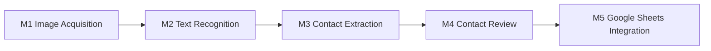

# Card2Contact — MMVP

## MMVP Summary

Card2Contact turns a photographed or uploaded business card into a saved contact row in Google Sheets. A user signs in with Google (which auto-creates their own dedicated spreadsheet on first login), captures one or two images (front, or front + back), the text on the card is recognized, structured contact fields are extracted from that text, the user reviews and edits those fields, and the confirmed contact is appended to their spreadsheet. Every later scan appends another row to the same sheet.

## Pipeline

## How to read these docs

New to the project: start here for the pipeline shape, then read
[ARCHITECTURE.md](ARCHITECTURE.md) for how it's actually wired (stack,
session state, error conventions), then the specific module doc for the
area you're changing. Already familiar: jump straight to the module doc —
each one is self-contained, with cross-links where it depends on another.

## Modules

| Module | Description |
|---|---|
| [M1 – Image Acquisition](modules/M1-Image-Acquisition.md) | Captures or uploads the business card image(s) that start the pipeline. |
| [M2 – Text Recognition](modules/M2-Text-Recognition.md) | Converts card image(s) into raw text via OCR. |
| [M3 – Contact Extraction](modules/M3-Contact-Extraction.md) | Parses raw OCR text into structured contact fields. |
| [M4 – Contact Review](modules/M4-Contact-Review.md) | Lets the user review, edit, and confirm extracted contact data. |
| [M5 – Google Sheets Integration](modules/M5-Google-Sheets-Integration.md) | Saves the confirmed contact as a row in the user's own Google Sheet. |
| [Users & Persistence](modules/Users-Persistence.md) | Shared infra: multi-user identity, Postgres `users` table, OAuth tokens, session cookie. |
| [Admin](modules/admin/) | Operator surface: a separate admin login at `/admin/login`, independent of Google OAuth, guarding all `/api/admin/*` routes. |

## Implementation

See [ARCHITECTURE.md](ARCHITECTURE.md) for cross-cutting implementation decisions (tech stack, persistence, session, error conventions, credentials) that fill in gaps the module docs above left unspecified.
