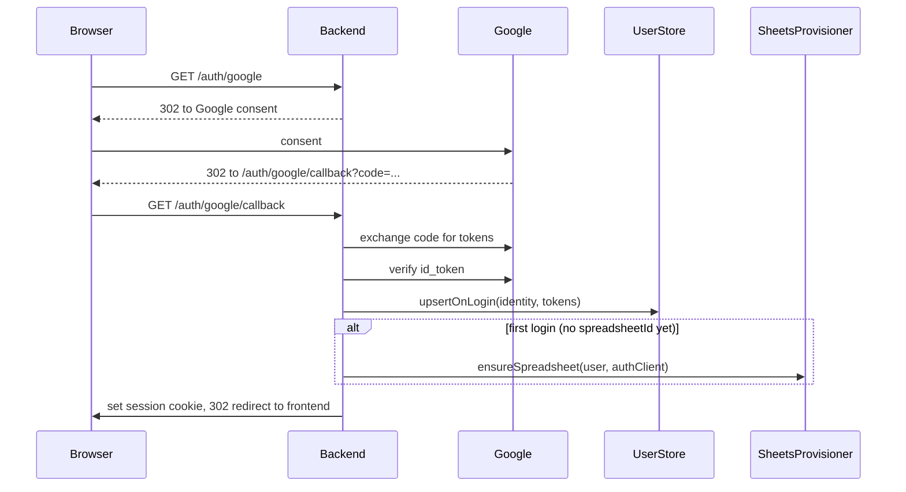
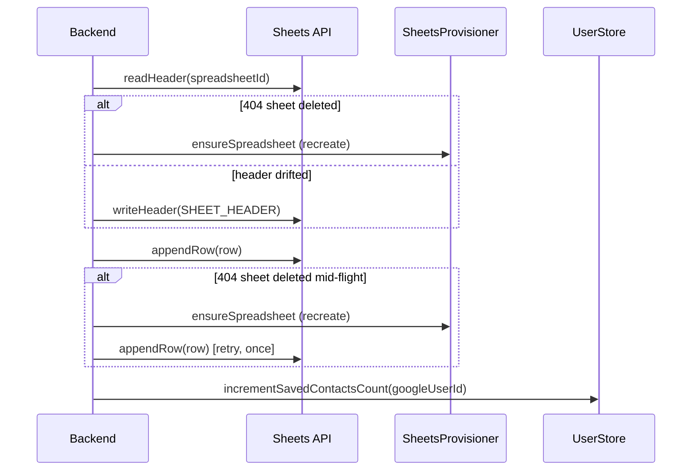

# M5 — Google Sheets Integration — Design

## Quick reference

- `GET /api/auth/google`, `GET /api/auth/google/callback`, `GET /api/auth/google/status`, `POST /api/auth/logout`
- `POST /api/contacts/save`
- Depends on: confirmed `Contact` for `cardId` from M4 · Provides: nothing back into the pipeline (terminal step)

## 1. Purpose & scope

Saves the confirmed `Contact` as a row in the user's own Google Sheet — the only durable Sheets write in the pipeline.
Does NOT: let the user pick/connect a different spreadsheet, or apply spreadsheet formatting/styling.

## 2. Audience & permissions

Multi-user. Each user signs in with Google (OAuth 2.0) and is identified by their Google account id (`sub` from the verified id_token). A signed, httpOnly session cookie keeps them logged in. Every user gets their own auto-created spreadsheet; a user can only write to their own.

| Scope | Purpose |
|---|---|
| `openid`, `email`, `profile` | identify the user via the verified id_token (`sub` + `email`) |
| `.../auth/spreadsheets` | create and append to the user's own sheet — no separate Drive scope needed |

## 3. Entities (data model)

Persisted in Postgres (`users` table — see [Users-Persistence.md](./Users-Persistence.md)): `google_user_id`, `email`, `spreadsheet_id`/`_url`/`_title`, the OAuth token pair (AES-256-GCM encrypted through the `TokenCodec` seam), `token_expiry`, `saved_contacts_count`, and audit timestamps. The `Contact` itself is never stored server-side — it is passed from M4 straight into the append call, and is never written to the audit log either (it is our users' *customers'* PII).

## 4. Business rules

- Each user's contacts are written to that user's own fixed-schema spreadsheet (columns: Name, Designation, Phone, Email, Company, Address, Note, Category — `SHEET_HEADER`).
- The spreadsheet is auto-created with its header row on first login and reused for all future scans.
- Multi-value fields (Phone[], Address[]) join with `"; "`.
- **Header integrity**: before appending, row 1 is read and repaired if it no longer matches `SHEET_HEADER` (read-and-repair, no schema versioning) — this is also how existing users pick up schema changes (e.g. the `Designation` column addition rewrites their header on next save). Repair only rewrites row 1; it does not shift already-written data rows, so historical rows saved under a shorter header appear misaligned by one column under a repaired longer header. A full backfill is out of scope.
- **Trashed-sheet recovery (Recreate Sheet)**: a spreadsheet the user moved to Trash reads and writes normally through the Sheets API and **never 404s** — so before every save, Drive is asked for its `trashed` flag (`drive.file` scope). A trashed sheet is abandoned, never reused: a new one is created and `spreadsheet_id`/`_url`/`_title` are all updated. This check runs **before** the header check, because `readHeader` succeeds on a trashed sheet — reversing the order would make the recovery dead code.
- **Deleted-sheet recovery**: if the sheet is gone (404), a new one is auto-created, the stored ids are updated, and the append is retried once.
- **Revoked access**: a revoked/expired refresh token surfaces as `401 { code: "REAUTH_REQUIRED" }` and the router nulls the user's tokens, so `/status` reports `needsReconnect` and the frontend prompts a Reconnect proactively — not only mid-save. The **session survives**: losing Google access is not losing your card2contact session.
- Each successful save increments the user's `saved_contacts_count`, surfaced via `/api/auth/google/status`.

## 5. Endpoints

`GET /api/auth/google` — start (or re-)consent; `302` to Google. Reused for "reconnect."

`GET /api/auth/google/callback` — exchange code, verify id_token, upsert the user, auto-create their sheet on first login, set the session cookie, `302` to the frontend.

- Request: query param `code` (from Google).
- Precondition: none. Postcondition: user row upserted; `spreadsheet_id` set if first login; session cookie set.

| Status | Error | Trigger |
|---|---|---|
| 400 | `ValidationError` | `code` missing or not a string |

`GET /api/auth/google/status` — no auth required; always `200`.

- Unauthenticated: `{ "authenticated": false }`
- Authenticated: `{ "authenticated": true, "email": "jane@acme.com", "needsReconnect": false, "spreadsheetUrl": "https://docs.google.com/spreadsheets/d/1AbC.../edit", "spreadsheetTitle": "Card2Contact Contacts", "savedContactsCount": 12 }`
- `spreadsheetUrl`/`spreadsheetTitle` omitted until a spreadsheet is provisioned. `needsReconnect: true` when the user row exists but tokens were cleared.

`POST /api/auth/logout` — clears the session cookie only; the refresh token is retained for frictionless re-login. Response (`200`): `{ "ok": true }`.

`POST /api/contacts/save` — appends the confirmed `Contact` to the current user's spreadsheet, with the recovery behavior in §4.

- Request: `{ "cardId": "3f1b...c9", "contact": { "name": "Jane Doe", "designation": "Branch Head", "phones": ["+1 555-123-4567"], "email": "jane@acme.com", "company": "Acme Inc", "addresses": [], "note": "", "category": "" } }` — requires an authenticated session.
- Response (`200`): `{ "cardId": "3f1b...c9", "saved": true }`
- Precondition: active session; `session.confirmed === true` and `session.contact !== null`.
- Postcondition: one row appended; `session.saved = true`; `user.savedContactsCount` +1.

| Status | Error | Trigger |
|---|---|---|
| 401 | `NotAuthenticatedError` | no active session (never logged in / cookie missing) |
| 400 | `ValidationError` | `cardId` missing, blank, or non-string |
| 400 | `ValidationError` | `contact` missing, `null`, or non-object |
| 404 | `CardNotFoundError` | `cardId` unknown |
| 409 | `PipelineOrderError` | card not `confirmed` yet (M4 `/confirm` not run) |
| 401 | `ReauthRequiredError` (`code: "REAUTH_REQUIRED"`) | Google rejects with 401/`invalid_grant` — refresh token revoked/expired |

A deleted spreadsheet (Google 404) is not an error case exposed to the client — it's recovered per §4 before responding.

## 6. Inter-module contracts

- Depends on: confirmed `Contact` for `cardId` from M4; the `UserStore` (identity + tokens + spreadsheet id); a `SheetsProvisioner` (shared interface) for sheet creation, supplied by the composition root so google-auth never imports google-sheets.
- Provides: nothing back into the pipeline — terminal step.

## Out of Scope

- User-selectable spreadsheets.
- Spreadsheet formatting or styling.

## Implementation Notes

### Algorithm

Row append uses `spreadsheets.values.append` with `valueInputOption: "RAW"`. Sheet creation uses `spreadsheets.create` (can't seed rows) followed by `values.update` to write the header. `spreadsheets.values.get` reads row 1 for the integrity check.

`GoogleAuthService` is stateless — `handleCallback` verifies the id_token and returns identity + tokens; `authClientForUser` builds a fresh `OAuth2Client` from one user's stored tokens, persisting silent refreshes via `UserStore.updateTokens`.

### Error handling

`classifyGoogleError` (`google-sheets.client.ts`) maps Google API failures to domain errors: 404 → `SheetNotFoundError` (recover), 401/`invalid_grant` → `ReauthRequiredError` (Reconnect), else rethrow. It stays a pure classifier with no store access — the *policy* of nulling tokens on `invalid_grant` lives in the router, not here.

`isTrashed` is the one Drive call: `files.get(fileId, fields: "trashed")`. A 404 from Drive means hard-deleted, which returns `true` — unusable either way, and the recovery is identical. A 401 propagates as `ReauthRequiredError` rather than reporting "trashed", since recreating on revoked access would be wrong and would burn a Sheets create on every save.

The only retry in the system: exactly one, only on a 404, only around `appendRow`. It is the last-resort race handler — the sheet deleted *between* our checks and the append. `ReauthRequiredError` and any other error fail immediately, no retry. No rollback anywhere — a failed save leaves `session.saved` at `false`; anything already written (e.g. a recreated sheet) stays.

`POST /api/contacts/save` is not idempotent — calling it twice on an already-saved card appends a second row (no dedup/lock).

### Performance

Up to 4 Google API calls per save (`readHeader`, optional `writeHeader`, `appendRow`, optional recreate + retry `appendRow`) plus 1 Postgres write. OAuth callback: 1 token exchange + 1 id_token verify + 1 Postgres upsert, plus up to 2 Sheets calls on first login only.

- Env vars: `GOOGLE_OAUTH_CLIENT_ID`, `GOOGLE_OAUTH_CLIENT_SECRET`, `GOOGLE_OAUTH_REDIRECT_URI`, `SESSION_SECRET`, `DATABASE_URL`. `GOOGLE_SHEETS_SPREADSHEET_ID` is no longer used.
- Token encryption is postponed: `IdentityTokenCodec` (pass-through) is wired today; enabling `AesGcmTokenCodec` is a one-line change in `index.ts` plus a `TOKEN_ENCRYPTION_KEY` env var.
- Implemented in `backend/src/modules/google-sheets/` (Sheets logic) and `backend/src/modules/google-auth/` (OAuth login flow), with shared persistence/session under `backend/src/shared/`.
