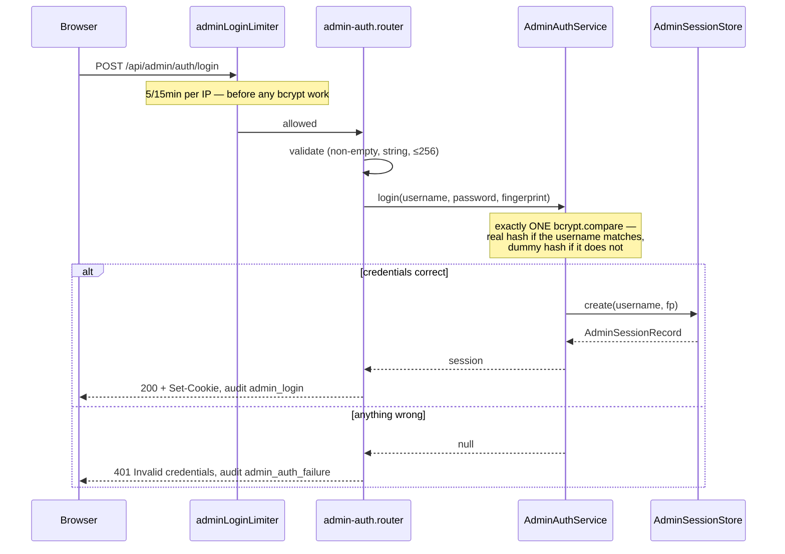

# Admin Authentication — Design

## Quick reference

- `POST /api/admin/auth/login`, `POST /api/admin/auth/logout`, `GET /api/admin/auth/me`
- Depends on: `AdminConfig` (env) · `AdminSessionStore` (shared interface) · Provides: the `adminAuth` guard for every future `/api/admin/*` route
- Independent of Google OAuth in every respect: separate credential, separate cookie, separate store, separate request property.

## 1. Purpose & scope

Gives the operator who runs the deployment a way to sign in as themselves — a
username and a bcrypt password at `/admin/login`, with no Google account
involved — and establishes the seam that Phase 0.2+ admin features attach to.

Does NOT: federate with Google or any other IdP, manage or invite users, support
more than one admin, offer password reset/rotation from the UI, or provide MFA.
It also does not (yet) put anything behind the login except a placeholder — the
value in Phase 0.1 is the authenticated seam, not the page.

## 2. Audience & permissions

A single operator, identified by `ADMIN_USERNAME`. There is no admin identity
table and no role model: one credential, one level of access. An admin is not a
user of the product and need not have a Google account; a signed-in Google user
is not an admin.

### Threat model

What this defends, and against whom. The asset is the **Admin Session** — in
Phase 0.1 it unlocks only a placeholder, but it is the key every future admin
route will trust, so it has to be right while it is cheap. The password is a
secondary asset: it exists at rest only as a bcrypt hash, only in `.env`.

| # | Adversary | Capability | Defence | Residual risk |
|---|---|---|---|---|
| T1 | Anonymous internet | Guesses credentials at `/api/admin/auth/login` | bcrypt cost 12 (~100ms/attempt) + 5 attempts/15min/IP | A distributed attacker rotating IPs gets more attempts — the limiter is per-IP, in-memory, per-container (the same accepted bound as every other limiter) |
| T2 | Username enumerator | Probes to learn whether `ADMIN_USERNAME` is right, halving the search | Byte-identical generic 401 for every credential failure + a constant-work bcrypt compare against a dummy hash on a username miss | The username may leak by other means (a screenshot, `.env` on a shared box) — out of scope |
| T3 | A signed-in end user | Presents their `c2c_session` to an admin route | `adminAuth` reads only `admin_session`, from a store that has never heard of Google ids | None known — the isolation suite exists to keep it that way |
| T4 | Admin session leaking sideways | Presents `admin_session` to a user route | `req.adminAuth` is a distinct property; `requireAuth` and `createSaveLimiter` read `req.auth`, which admin never populates | None known |
| T5 | Cookie thief (XSS, shoulder-surf, shared machine) | Replays a stolen `admin_session` | `httpOnly`, `signed`, `sameSite:"strict"`, 8h Absolute Lifetime, `Secure` in prod | **A stolen cookie works until it expires — there is no admin revoke endpoint in 0.1. The mitigation is a restart** (see §4) |
| T6 | CSRF | Makes the operator's browser POST to an admin route | `sameSite:"strict"` withholds the cookie on every cross-site request — stronger than the app's documented lax-only posture, and free because admin has no OAuth redirect to accommodate | None known for admin routes |
| T7 | Log reader (`docker logs`) | Harvests credentials from the audit stream | The password is never logged in any form; the hash never is; session ids truncate to 8 chars at the sink | `adminUsername` **is** logged, deliberately — justified in ARCHITECTURE.md's field policy |
| T8 | Database disclosure (leaked backup, SQLi, old disk) | Reads admin credentials at rest | **Nothing to read.** No admin table exists; sessions live in memory; the password is a bcrypt hash in `.env` | Trades to T9 |
| T9 | Misconfigurer (us) | Ships a blank or plaintext password, or half the config | `resolveAdminConfig` throws at boot on a non-bcrypt hash, a blank username, or exactly-one-var-set; both absent = feature off | A *weak* password that hashes correctly is not defended — bcrypt slows guessing, it does not fix `password123` |

Explicitly **not** defended: a compromised backend host (`.env` is readable by
root — same posture as `TOKEN_ENCRYPTION_KEY`); a malicious admin; MFA; account
lockout (rate limiting only — locking a single shared credential is a
self-inflicted DoS); distributed brute force.

## 3. Entities (data model)

**No database table.** Two pieces of state:

`AdminConfig` — resolved from the environment at boot (`admin-auth.config.ts`):

| Field | Source | Notes |
|---|---|---|
| `username` | `ADMIN_USERNAME` | Trimmed once at boot; the submitted value is never trimmed |
| `passwordHash` | `ADMIN_PASSWORD_HASH` | bcrypt only; shape-validated at boot |

`AdminSessionRecord` — in memory (`shared/store/admin-session-store.ts`):
`id` (256-bit `randomBytes`, base64url), `username`, `createdAt`,
`lastActivityAt` (recorded, never read for expiry), `device`, `browser`, `ip`.

**Why no table.** `sessions` declares
`google_user_id TEXT NOT NULL REFERENCES users(google_user_id)` and every
`SessionStore` method is Google-shaped; an admin has no Google identity, so
reusing it would need a nullable FK — destroying the property that an admin
session is *structurally incapable* of being a user session. Same reasoning that
keeps `pending_sessions` separate from `sessions`.

**Why in memory.** The durability of `sessions` solves problems admin does not
have: cross-device Session Replacement, a `/status` contract polled on window
focus, a 7-day lifetime that must outlive deploys. Admin has one operator and an
8h lifetime. The cost — a deploy signs the admin out — is a non-event for one
operator, and is load-bearing (see §4). The `AdminSessionStore` interface is the
seam: a Postgres implementation would be a new class plus one wiring line.

## 4. Business rules

- **Both or neither.** Setting only `ADMIN_USERNAME` or only `ADMIN_PASSWORD_HASH` is a boot error naming the missing one. Setting neither disables the panel; setting both enables it.
- **Absent is off, present is validated.** Unconfigured, all three routes answer `503 ADMIN_NOT_CONFIGURED` — no credential can succeed because no credential exists. Configured, the hash must match `/^\$2[aby]\$\d{2}\$[./A-Za-z0-9]{53}$/` or the backend refuses to start: `bcrypt.compare` against a plaintext value returns `false` forever, so booting with one locks the admin out with no error anywhere.
- **Every credential failure is identical.** Wrong username, wrong password, both wrong, wrong case — all return byte-identical `401 {"error":"Invalid credentials","code":"ADMIN_INVALID_CREDENTIALS"}`. A *malformed* request (missing/non-string field) is a distinguishable `400`: the caller already knows what they sent, so it reveals nothing.
- **Constant work on every attempt.** Exactly one `bcrypt.compare` runs per login regardless of outcome — against the real hash when the username matches, against a module-load-generated dummy hash when it does not. This is what removes the *timing* oracle that the identical response removes in the value domain.
- **Credentials are length-capped at 256 chars** before any hashing, so an unauthenticated endpoint cannot be made to do unbounded work.
- **The admin panel is invisible to the user session**, and vice versa — see §6.

### Session expiry rules

| Rule | Admin | User (for contrast) | Why the difference |
|---|---|---|---|
| **Absolute Lifetime** | **8h** from creation. The only bound. | 7d | An operator session is bounded by a work session and carries no "keep me signed in" expectation. Short caps how long a stolen cookie is useful. |
| **Idle Timeout** | **None.** | 30d (never binds — absolute kills it first) | With an 8h absolute cap, any idle bound worth having is unreachable *by construction*. The user session already demonstrates this; admin declines to ship a constant that can never fire. `lastActivityAt` is recorded for audit and never read for expiry. |
| **Sliding renewal** | **No.** Activity does not extend the session. | n/a | A sliding window keeps a stolen cookie alive exactly as long as the thief keeps using it — the inverse of the point. |
| **Cookie `maxAge`** | `ADMIN_SESSION_ABSOLUTE_MS` (8h) | matches `SESSION_ABSOLUTE_MS` | The browser must discard the cookie the instant the server stops honouring it. Both derive from one constant so they cannot drift. |
| **Enforcement** | In `findActive` — expired is dead the moment it expires, purge or no purge | in SQL, same reasoning | Correctness lives in the lookup; purging is space only. |
| **Expiry vs revocation** | **Not distinguished** — unknown, expired and revoked all give one generic 401 | distinguished (`SESSION_REVOKED` explains Session Replacement) | Admin has no "you signed in elsewhere" story to tell, and one generic failure keeps T2 whole. |
| **Restart** | All Admin Sessions die | survive (Postgres) | Accepted, and load-bearing: **the restart IS the revocation mechanism.** There is no admin revoke endpoint in 0.1, so evicting a suspected-stolen session, or rotating the password, means a redeploy. |

## 5. Endpoints

`POST /api/admin/auth/login` — exchange credentials for an Admin Session.

- Request: `{ "username": "admin", "password": "…" }`
- Response (`200`): `{ "username": "admin" }` + `Set-Cookie: admin_session=…; HttpOnly; SameSite=Strict; Path=/; Max-Age=28800`
- Precondition: admin configured. Postcondition: one Admin Session exists; `admin_login` audited.



| Status | Error | Trigger |
|---|---|---|
| 400 | `ValidationError` | `username`/`password` missing, non-string, empty, or >256 chars |
| 401 | `AdminInvalidCredentialsError` (`code: "ADMIN_INVALID_CREDENTIALS"`) | Wrong username, wrong password, or both — indistinguishable |
| 429 | — | More than 5 attempts in 15 minutes from one IP |
| 503 | `AdminNotConfiguredError` (`code: "ADMIN_NOT_CONFIGURED"`) | `ADMIN_USERNAME`/`ADMIN_PASSWORD_HASH` unset |

`GET /api/admin/auth/me` — the current admin. The template every future admin route follows (`router.use(adminAuth)`).

- Request: the `admin_session` cookie. Response (`200`): `{ "username": "admin" }`
- Precondition: a live Admin Session.

| Status | Error | Trigger |
|---|---|---|
| 401 | `AdminNotAuthenticatedError` (`code: "ADMIN_NOT_AUTHENTICATED"`) | No cookie, bad signature, unknown/expired/revoked session — all identical |
| 503 | `AdminNotConfiguredError` | Admin unconfigured |

`POST /api/admin/auth/logout` — Session Termination. Idempotent.

- Response (`200`): `{ "ok": true }` + a cleared cookie. Never 401 — telling someone they cannot log out because they are not logged in is pointless.
- Postcondition: the session (if any) is gone; `admin_logout` audited only if one was actually ended.

| Status | Error | Trigger |
|---|---|---|
| 503 | `AdminNotConfiguredError` | Admin unconfigured |

## 6. Inter-module contracts

- **Provides `adminAuth`** (`shared/http/admin-auth.ts`). Every future `/api/admin/*` router mounts under the `/api/admin` path in `app.ts` and calls `router.use(adminAuth)` at its top. The guard lives in `shared/http/` — not in this module — precisely so a second admin module can apply it without importing this one, which would breach the module boundary rule.
- **Depends on** `AdminSessionStore` (shared interface, in-memory implementation) and `AdminConfig`. It imports no other module, and no other module imports it: `app.ts` wires everything.
- **`createSessionMiddleware` skips `/api/admin` entirely** (`shared/http/session.ts`). Load-bearing — see Implementation Notes.

## Out of Scope

- Admin dashboard content (Phase 0.2+ — `/admin/dashboard` is a placeholder).
- Multiple admins, roles, or an admin identity table.
- Password rotation/reset from the UI (rotate via `.env` + redeploy).
- Admin MFA.
- Durable admin sessions surviving a restart.
- An admin session-revocation endpoint (restart is the mechanism).

## Implementation Notes

### Algorithm

The login's constant-work compare, in `admin-auth.service.ts`:

```
usernameOk = timingSafeEqualStr(username, config.username)
hash       = usernameOk ? config.passwordHash : DUMMY_HASH
passwordOk = await bcrypt.compare(password, hash)   // ALWAYS runs
return usernameOk && passwordOk                     // && short-circuits the RETURN, not the work
```

`DUMMY_HASH` is `bcrypt.hashSync(randomBytes(32).toString("hex"), 12)`, computed
at module load — never a hand-written literal, since `compare()` against a
malformed hash returns false *fast* and would silently restore the oracle.

An early `if (!usernameOk) return false` is the single most likely way this
protection gets removed: it is functionally identical, faster, simpler, and
reopens the vulnerability. `admin-auth.service.test.ts` asserts the
`bcrypt.compare` **call count** on every path for exactly this reason — a
wall-clock assertion would be flaky under CI load and get skipped.

### Error handling

All three admin errors live in `shared/http/admin-errors.ts` (not
`pipeline-errors.ts`, which is documented as shared by all module routers) and
get their own branches in the one shared `errorHandler`. `AdminNotConfiguredError`
is the app's only non-4xx/500 domain error: 503 says "no credential could
succeed", which is the truth, where 401 would invite the operator to retype a
correct password forever.

One asymmetry worth knowing before it reads as a bug:

- **A rate-limited login audits as `auth_failure{reason:"rate_limited"}`, not `admin_auth_failure`.** The shared `makeLimiter` handler emits it, and parameterizing that handler would touch four working call sites to serve one caller. The `rate_limit_exceeded{endpoint:"admin_login"}` metric is what identifies it.

Oversized (`413`) and malformed (`400`) request bodies are handled by the shared
`errorHandler`'s body-parser branch, which applies to every route in the app —
not just admin. (These used to surface as a generic 500, which sent the caller
looking for a server bug that was their own request; body-parser already knows
the right status, and the handler now honours it.)

The cookie is named `admin_session` per the Phase 0.1 requirement, and notably
does **not** carry the `c2c_` prefix the user cookies use. Recorded as a decision:
the prefix is a convention nothing reads, and renaming a cookie later signs out
every admin.

### Performance

bcrypt cost 12 is ~100ms per login attempt, deliberately — it is the work factor
that makes guessing expensive. Every login pays it once, including failures
(that is the point). The limiter is 5/15min rather than OAuth's 10 because this
is a password endpoint with a guessable username, where the OAuth route is a
redirect with Google's throttling behind it.

### Purge

`InMemoryAdminSessionStore` owns a self-contained hourly `setInterval`, `unref()`'d
so it never holds the process open. It is legitimate here (where `PgSessionStore`
defers to `index.ts`) precisely because this store owns its own storage — and
without it nothing would ever call `purgeExpired()`, so expired records would
accumulate for the life of the container. It is **not** a correctness mechanism:
`findActive` enforces the 8h bound on every lookup, so a purge that never runs is
a memory question, never an authentication one.

Implemented in `backend/src/modules/admin-auth/`, with the cookie policy, guard,
errors, and store under `backend/src/shared/http/` and `backend/src/shared/store/`.
