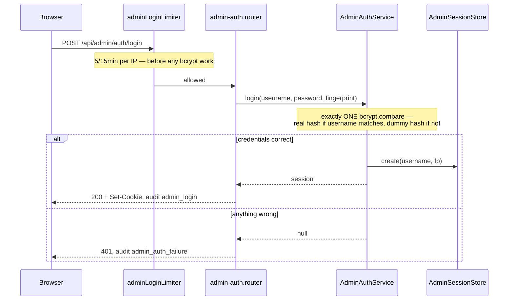

# Admin Authentication — Design

## Quick reference

- `POST /api/admin/auth/login`, `POST /api/admin/auth/logout`, `GET /api/admin/auth/me`
- Depends on: `AdminConfig` (env), `AdminSessionStore` (shared interface) · Provides: the `adminAuth` guard for every `/api/admin/*` route
- Independent of Google OAuth in every respect: separate credential, cookie, store, request property.

## 1. Purpose & scope

Lets the operator sign in as themselves — username + bcrypt password at
`/admin/login`, no Google account involved — and establishes the seam
later admin features attach to.

Does NOT: federate with an IdP, manage/invite users, support more than one
admin, offer password reset/rotation from the UI, or provide MFA.

## 2. Audience & permissions

A single operator, identified by `ADMIN_USERNAME`. No admin identity table,
no role model: one credential, one access level. An admin is not a product
user and need not have a Google account; a signed-in Google user is not an
admin.

## 3. Threat model

The asset is the **Admin Session** — it unlocks every future admin route,
so it has to be right while it's cheap. The password is secondary: it
exists at rest only as a bcrypt hash, only in `.env`.

| # | Risk | Defence |
|---|---|---|
| T1 | Credential guessing | bcrypt cost 12 (~100ms/attempt) + 5 attempts/15min/IP |
| T2 | Username enumeration | Identical generic 401 for every failure + constant-work bcrypt compare against a dummy hash on a username miss |
| T3 | End user's `c2c_session` reaches an admin route | `adminAuth` reads only `admin_session`, from a store that's never heard of Google ids |
| T4 | Admin session leaking into a user route | `req.adminAuth` is distinct; `requireAuth`/`createSaveLimiter` read `req.auth`, which admin never populates |
| T5 | Stolen `admin_session` cookie replayed | `httpOnly`, `signed`, `sameSite:"strict"`, 8h Absolute Lifetime, `Secure` in prod — **no revoke endpoint in 0.1; a restart is the mitigation** |
| T6 | CSRF | `sameSite:"strict"` withholds the cookie cross-site — stronger than the app's usual lax posture, free since admin has no OAuth redirect to accommodate |
| T7 | Credential harvesting from logs | Password/hash never logged; session ids truncate to 8 chars. `adminUsername` **is** logged deliberately (see ARCHITECTURE.md's field policy) |
| T8 | DB disclosure | Nothing to read — no admin table, sessions in memory, password is a bcrypt hash in `.env` |
| T9 | Misconfiguration | `resolveAdminConfig` throws at boot on a non-bcrypt hash, blank username, or exactly-one-var-set |

Not defended: a compromised host, a malicious admin, MFA, account lockout
(rate limiting only — locking a single shared credential is a
self-inflicted DoS), distributed brute force.

## 4. Entities (data model)

No database table. `AdminConfig` resolved from env at boot
(`admin-auth.config.ts`): `username` (`ADMIN_USERNAME`), `passwordHash`
(`ADMIN_PASSWORD_HASH`, bcrypt-shape-validated).

`AdminSessionRecord` — in memory (`shared/store/admin-session-store.ts`):
`id` (256-bit random, base64url), `username`, `createdAt`,
`lastActivityAt` (recorded, never read for expiry), `device`, `browser`,
`ip`.

**No table** because `sessions` requires a non-null `google_user_id` FK —
reusing it would need a nullable FK, destroying the property that an admin
session is structurally incapable of being a user session. **In memory**
because the durability `sessions` provides (cross-device Session
Replacement, 7-day lifetime) solves problems admin doesn't have; the cost —
a deploy signs the admin out — is load-bearing (see §6, Restart).

## 5. Business rules

- **Both env vars or neither.** One-set-one-missing is a boot error naming
  the gap; neither disables the panel; both enables it.
- **Unconfigured → `503` on every route**, no credential can succeed.
  Configured, the hash must match bcrypt's format or the backend refuses to
  boot — booting with a plaintext value would lock the admin out silently.
- **Every credential failure is byte-identical** `401
  ADMIN_INVALID_CREDENTIALS` — wrong username, password, or both. A
  malformed request (missing/non-string field) is a distinguishable `400`.
- **Constant work on every attempt** — exactly one `bcrypt.compare` always
  runs, against the real hash on a username match or a dummy hash
  otherwise, removing the timing oracle the identical response removes in
  the value domain.
- Credentials capped at 256 chars before hashing.

### Session expiry

| Rule | Admin | User (contrast) |
|---|---|---|
| Absolute Lifetime | **8h**, the only bound | 7d |
| Idle Timeout | **None** — unreachable given the 8h cap | 30d |
| Sliding renewal | **No** | n/a |
| Expiry vs. revocation | Not distinguished — one generic 401 | Distinguished (`SESSION_REVOKED`) |
| Restart | **All Admin Sessions die — this is the revocation mechanism**, since there's no admin revoke endpoint in 0.1 | Survive (Postgres) |

## 6. Endpoints

**`POST /api/admin/auth/login`** — exchange credentials for an Admin
Session.

- `{username, password}` → `200 {username}` + `Set-Cookie: admin_session=…;
  HttpOnly; SameSite=Strict; Max-Age=28800`
- `400 ValidationError` (missing/non-string/empty/>256 chars) · `401
  ADMIN_INVALID_CREDENTIALS` · `429` (>5/15min/IP) · `503
  ADMIN_NOT_CONFIGURED`



**`GET /api/admin/auth/me`** — the template every admin route follows
(`router.use(adminAuth)`). `200 {username}` or `401
ADMIN_NOT_AUTHENTICATED` (no cookie, bad signature, unknown/expired —
indistinguishable).

**`POST /api/admin/auth/logout`** — Session Termination, idempotent. `200
{ok: true}` + cleared cookie, never 401. `admin_logout` audited only if a
session actually ended.

## 7. Inter-module contracts

- **Provides `adminAuth`** (`shared/http/admin-auth.ts`) — every admin
  router mounts under `/api/admin` in `app.ts` and calls
  `router.use(adminAuth)`. Lives in `shared/http/`, not this module,
  precisely so other admin modules can apply it without importing this one.
- **Depends on** `AdminSessionStore` + `AdminConfig` only; no module
  imports it except `app.ts`.
- **`createSessionMiddleware` skips `/api/admin` entirely** — see
  Implementation Notes.

## Out of Scope

Dashboard content beyond a placeholder (Phase 0.2+) · multiple admins/roles
· password rotation from the UI (rotate via `.env` + redeploy) · MFA ·
sessions surviving a restart · an admin revoke endpoint.

## Implementation Notes

**The constant-work compare** (`admin-auth.service.ts`):

```
usernameOk = timingSafeEqualStr(username, config.username)
hash       = usernameOk ? config.passwordHash : DUMMY_HASH
passwordOk = await bcrypt.compare(password, hash)   // ALWAYS runs
return usernameOk && passwordOk
```

`DUMMY_HASH` is generated at module load (never a literal — a malformed
hash makes `compare()` return false *fast*, silently restoring the timing
oracle). An early `if (!usernameOk) return false` is the most likely
regression here: functionally identical, faster, and reopens the
vulnerability — `admin-auth.service.test.ts` asserts `bcrypt.compare`
**call count**, not wall-clock, to catch it reliably under CI load.

**Errors** live in `shared/http/admin-errors.ts` (not
`pipeline-errors.ts`) with their own branches in the shared
`errorHandler`. `AdminNotConfiguredError` → 503, not 401: "no credential
could succeed" is the truth, where 401 invites retyping a correct password
forever. One asymmetry: a rate-limited login audits as
`auth_failure{reason:"rate_limited"}`, not `admin_auth_failure` — the
shared limiter handler emits it, and parameterizing it would touch four
working call sites for one caller.

The cookie is `admin_session`, deliberately without the `c2c_` prefix user
cookies use — nothing reads that prefix, and renaming later signs out
every admin.

**Purge**: `InMemoryAdminSessionStore` owns a self-contained hourly
`setInterval` (`unref()`'d). Not a correctness mechanism — `findActive`
enforces the 8h bound on every lookup regardless — just prevents expired
records accumulating for the container's life.

Implemented in `backend/src/modules/admin-auth/`, with the cookie policy,
guard, errors, and store under `backend/src/shared/http/` and
`backend/src/shared/store/`.
