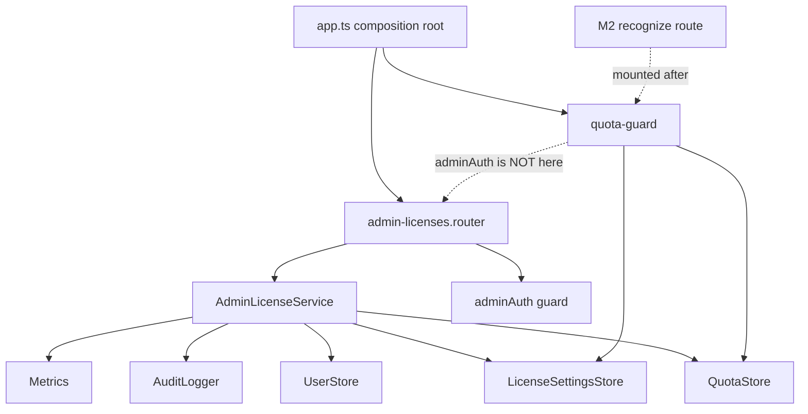
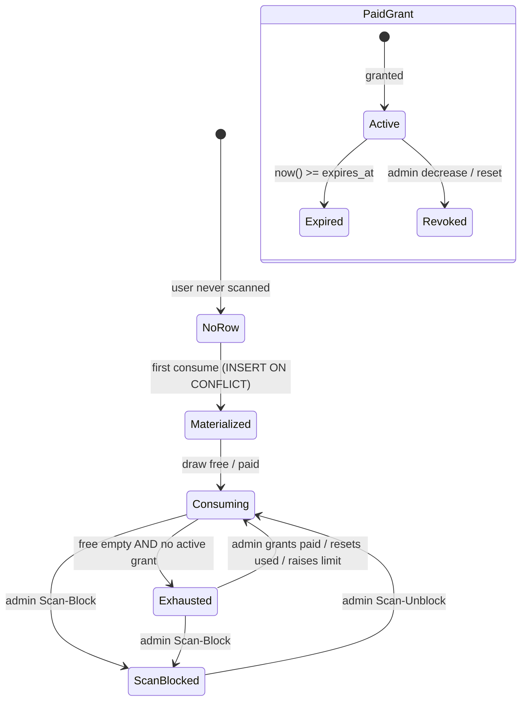
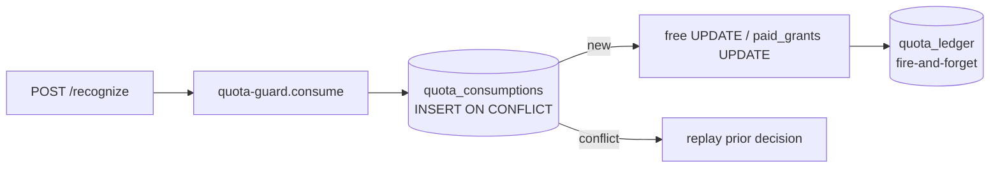
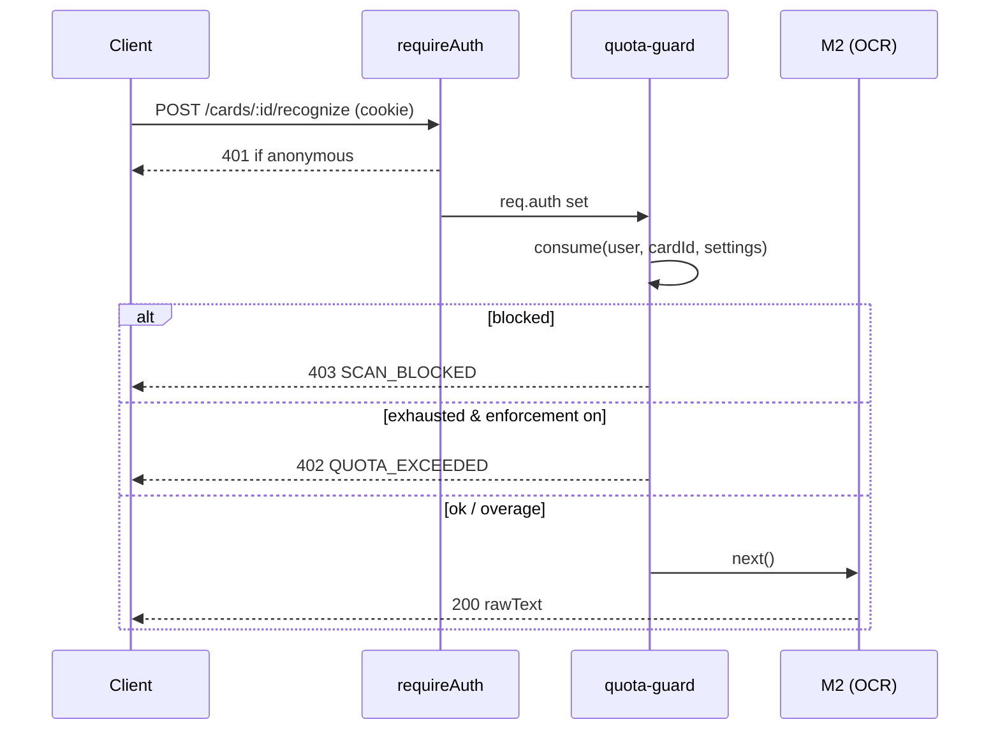

# License Management / Scan Quota — Design

## Quick reference

- **Routes:** `/api/admin/licenses/*` (settings + per-user quotas), all behind
  `adminAuth`. Enforcement runs on the pipeline: `POST /api/cards` (M1) now
  requires a signed-in user, and `POST /api/cards/:cardId/recognize` (M2) passes
  the **quota guard**.
- **Depends on:** `QuotaStore`, `LicenseSettingsStore` (new shared contracts),
  `UserStore` (existence check only), `AuditLogger`, `Metrics`, and the shared
  `adminAuth` guard.
- **Provides:** scan metering + enforcement for the pipeline; admin CRUD over
  free/paid allowances.
- **Isolation:** the pipeline modules (M1–M5) import nothing quota-related —
  enforcement is composed in `app.ts` as middleware, exactly like M5's
  `requireAuth`/save-limiter. The quota guard reads `req.auth` (set by the
  session middleware) and `req.params.cardId`.
- **Implemented in:**
  - Backend stores: `backend/src/shared/store/quota-store.ts`,
    `backend/src/shared/store/license-settings-store.ts`
  - Schema: `backend/src/shared/db/init.ts` (`initLicenseSchema`)
  - Module: `backend/src/modules/admin-licenses/{admin-licenses.service.ts,
    admin-licenses.router.ts}`
  - Enforcement: `backend/src/shared/http/quota-guard.ts`,
    errors in `backend/src/shared/http/pipeline-errors.ts`
  - Tier layer: `backend/src/shared/store/tier-store.ts` + tier methods on
    `quota-store.ts`; tables in `initTierSchema` (`db/init.ts`)
  - Upgrade requests: `backend/src/shared/store/tier-request-store.ts`
    (`initTierRequestSchema`); admin approve/reject on `AdminLicenseService`;
    user surface `backend/src/modules/licensing/{licensing.service.ts,
    licensing.router.ts}` at `/api/me/*`
  - Frontend admin UI: `frontend/src/routes/admin/AdminLicenses.tsx`,
    `AdminLicenseDetail.tsx`, `AdminTiers.tsx`, `AdminLicenseSettings.tsx`,
    `AdminRequests.tsx`; hooks in `frontend/src/features/admin/useAdminLicenses.ts`;
    scan gating in `frontend/src/features/scan/ScanLimitPanel.tsx`.
  - Frontend user UI: `frontend/src/features/plan/{PlanCard.tsx,
    MyRequestsCard.tsx, UpgradeRequestDialog.tsx, useMyPlan.ts}` (on the Profile
    page). `PlanCard` shows the active plan + the single latest decided
    request; `MyRequestsCard` lists the user's full request history via
    `GET /api/me/requests`. Both share request-describing/status-badge helpers
    from `frontend/src/shared/lib/tierRequest.ts`, also used by the admin
    `AdminRequests.tsx` queue and `AdminUserRequestsCard.tsx`.

## 1. Purpose & scope

Meters **scans** and enforces per-user quotas so the app has a usage/billing
boundary. A **scan** is one OCR run (M2, the expensive Mistral call); it is the
metered unit. A scan that later fails extraction (M3) or save (M5) still counts —
the cost was already incurred at OCR.

Key definitions (see also CLAUDE.md Terminology):

- **Free pool** — a per-user counter with a NULLable override; effective limit =
  `COALESCE(free_limit_override, default_free_limit)`. No expiry.
- **Paid pool** — the sum of a user's non-expired, unrevoked **Grants**.
- **Grant** — one dated paid allowance (`amount`, `used`, `expires_at`), with a
  computed **Active / Expired / Revoked** status.
- **Consume** — draw one unit at OCR: free first, then the soonest-to-expire
  active grant (use-it-or-lose-it).
- **Enforcement** — the global hard-block toggle. ON (default): an exhausted user
  is 402'd. OFF: consumption is still recorded but never blocks (incident mode).
- **Scan-Block** — a per-user scanning-only block (403 `SCAN_BLOCKED`), distinct
  from Revoke Access (which blocks login).
- **Tier** — a named, admin-editable allowance preset (Free / Professional /
  Enterprise, and any **Custom** tier). A tier is DATA, never a name the code
  branches on: enforcement reads only `is_unlimited` / `scan_limit` /
  `validity_days`.
- **Unlimited** — a per-tier flag (`is_unlimited`). An unlimited assignment grants
  a per-user "never block" window; usage is still recorded for analytics.
- **Tier assignment** — assigning a tier snapshots its values as-of-now (so a
  later catalog edit never changes an already-assigned user) and, for a limited
  tier, creates a tier-stamped Grant; for an unlimited tier, sets the window.

Out of scope: real billing/payment gateway integration and self-service
purchase. Tier assignment is one service method (`assignTier`) — the seam a
future payment webhook calls instead of an admin click.

## 2. Dependency graph

M2 never imports the guard or the store; `app.ts` mounts
`requireAuth → quotaGuard` on the recognize path before the M2 router.

## 3. Quota lifecycle

An **Exhausted** user scanning under enforcement gets 402. A **Scan-Blocked**
user gets 403 regardless of remaining quota. An **Expired** or **Revoked** grant
is simply not drawable — status is computed, no sweeper.

## 4. Audience & threat model

| # | Risk | Defence |
|---|---|---|
| Q1 | A retried OCR request double-charges | Exactly-once: `quota_consumptions` UNIQUE `(google_user_id, card_id)`; a retry replays the prior decision, no second decrement |
| Q2 | An anonymous user scans unmetered | M1 requires `requireAuth`; an unattributable scan is refused up front (401) |
| Q3 | Concurrent scans race the same grant | Paid draw uses `FOR UPDATE SKIP LOCKED` — concurrent scans pick different grant rows |
| Q4 | An expired grant keeps being drawn | Consume filters `now() < expires_at`; status is computed at read time |
| Q5 | Scan-Block confused with Revoke Access | Distinct table column (`scan_blocked_at`), distinct error/code (`SCAN_BLOCKED` 403 vs `USER_DISABLED` 403); clients branch on `code` |
| Q6 | A ledger write failure blocks a paid scan | Counters/grants are atomic truth; the ledger is fire-and-forget — enforcement never depends on a ledger write |
| Q7 | An admin sets a negative limit / bad grant | `LicenseValidationError` (400 `LICENSE_INVALID`) on non-integer/negative limits, non-positive amounts, bad dates |

## 5. Business rules

- **Consume order:** free first (if `free_enabled`), then the soonest-to-expire
  active grant (if `paid_enabled`). `NULLS LAST` so never-expiring grants are
  spent only after dated ones.
- **Enforcement OFF** still records consumption (counters + ledger move) but never
  returns 402 — a soft over-limit mode. Scan-Block is enforced in **both** modes
  (it is an administrative decision, not an allowance state).
- **Metering point:** the guard runs before the M2 handler, so an exhausted or
  blocked request never reaches Mistral.
- **Reset semantics:** "remove free override" = `SET free_limit_override = NULL`
  (back to default). "Reset paid" = revoke all grants. "Reset used" = zero the
  counters. "Recalculate" = reconcile counters from `quota_consumptions`.

### 5a. Tiers (the product layer)

- **Config, not name.** Enforcement resolves a user's allowance from the tier's
  *configuration* (`is_unlimited`, `scan_limit`, `validity_days`), never its name.
  A brand-new Custom tier works with zero code — a tested invariant.
- **Unlimited short-circuit.** When `scan_quotas.unlimited_until` is in the
  future, consume returns `pool:"unlimited"` and allows-always **without
  decrementing** any counter; the consumption row + ledger still record the scan
  for analytics. Enforcement keys off this time window, set from the tier config.
- **Assignment = snapshot.** Assigning a tier writes a `tier_assignments` row that
  *snapshots* the tier's values as-of-now. Editing a tier definition therefore
  affects **only future assignments** — an admin edit can never retroactively
  change 128 already-assigned users' quotas. This makes versioning free (the
  snapshot IS the version) and powers the "N users hold this tier" impact note.
- **Limited tier** → a tier-stamped `paid_grants` row (`amount = scan_limit`,
  `expires_at = now()+validity_days`). **Unlimited tier** → the
  `unlimited_until` window. On expiry the user **falls back to the default**
  (Free) automatically — lazy/computed, no cron.
- **One default.** Exactly one `is_default` tier (a partial unique index enforces
  it); archiving the default is rejected (400 `LICENSE_INVALID`).

### 5b. Tier Upgrade Requests (the user-initiated layer)

A user cannot grant themselves anything — but they can **ask**. An upgrade
request is *workflow metadata*, not an allowance: filing one changes no quota.
Only an admin decision acts, and it acts through the **existing `assignTier` /
`grantPaid` seam** — so there is one source of truth and the same seam a future
payment webhook calls.

- **Two shapes** (`kind`): `tier` (the user picked a catalog tier) or `custom`
  (an ad-hoc amount/duration with a required reason).
- **One pending per user.** A partial unique index
  (`WHERE status = 'pending'`) enforces "one open request" at the DB — a
  double-submit races to a single row and surfaces as **409
  `REQUEST_ALREADY_PENDING`**. After a decision the user can request again.
- **Approve may differ from the ask.** The admin can approve as-requested,
  approve a *different* tier, or convert to a custom paid grant — the decision
  columns are separate from the request columns. Approval resolves to **exactly
  one** of tier-or-amount (never both/neither), and a `grantDays`/`amount` of 0
  is rejected (400 — it would mint an already-expired grant).
- **Idempotent decision.** `decide()` guards on `status = 'pending'` in its
  WHERE clause; a second approve matches zero rows and is a no-op — never a
  double-grant. The request is marked decided *before* the grant runs, so a
  retry can't re-grant.
- **User-facing surface.** `GET /api/me/plan` (behind `requireAuth`, NOT
  `adminAuth`) returns the user's own quota + the tier catalog + their pending
  request + recent history. `POST /api/me/requests` files one. Same stores as the
  admin surface → "my plan" and the admin's "their quota" are one source of truth.

## 6. Entities (data model)

Eight tables, added idempotently in `initLicenseSchema` → `initTierSchema` →
`initTierRequestSchema` (`backend/src/shared/db/init.ts`), before the Token
Cutover wipe. No migration tool — `initSchema` runs every boot.

- **`license_settings`** — singleton row (`CHECK (id = TRUE)`): default free/paid
  limits, `free_enabled`, `paid_enabled`, `enforcement_enabled`, `updated_by`.
  Seeded with `INSERT ... ON CONFLICT (id) DO NOTHING`.
- **`scan_quotas`** — PK `google_user_id` (FK → users, `ON DELETE CASCADE`):
  `free_limit_override` (NULLable), `free_used`, Scan-Block columns
  (`scan_blocked_at/_by`, `scan_unblocked_at/_by`), and **`unlimited_until`**
  (the unlimited-tier window). Lazily materialized.
- **`paid_grants`** — one row per grant: `amount`, `used`
  (`CHECK used <= amount`), `expires_at` (NULL = never), `granted_by`,
  `revoked_at`, `reason`, and **`tier_id`** (the tier that stamped it, NULL for
  ad-hoc grants). Partial index on the drawable set.
- **`quota_consumptions`** — PK `(google_user_id, card_id)`: the exactly-once
  key, plus which `pool` (`free`/`paid`/`unlimited`)/`grant_id` a scan drew from.
- **`quota_ledger`** — append-only history (`kind`, `pool`, `grant_id`, `delta`,
  `reason`, `admin_username`). **No FK** — like `audit_log`, it outlives the row.
- **`tiers`** — the catalog: `name` (unique), `is_unlimited`, `scan_limit`
  (`CHECK (is_unlimited OR scan_limit IS NOT NULL)`), `validity_days`,
  `is_default` (partial unique index → exactly one), `archived_at` (soft-delete).
  Seeded Free/Professional/Enterprise via `ON CONFLICT (name) DO NOTHING`.
- **`tier_assignments`** — append-only snapshot history + current-tier source.
  Each row snapshots `tier_name/is_unlimited/scan_limit/validity_days/expires_at`
  as-of assign time, plus `previous_tier_*`, `action`
  (`assigned|changed|removed`), `assigned_by`. Current tier = latest non-`removed`
  row. **No FK on the snapshot** (self-describing even if the catalog later
  changes; `tier_id` references the never-hard-deleted `tiers`).
- **`tier_requests`** — user-filed upgrade requests: `kind` (`tier|custom`), the
  request columns (`requested_tier_id/_name`, `requested_amount`,
  `requested_days`, `user_note`, `current_tier_name`), `status`
  (`pending|approved|rejected`), and the decision columns (`decided_by/_at`,
  `decision_note`, `granted_tier_id`, `granted_amount`, `granted_days`).
  `CHECK` enforces the shape (a `tier` request names a tier; a `custom` one
  carries a note). Partial unique index on `(google_user_id) WHERE status =
  'pending'` → one open request per user.

## 7. Endpoints

All under `/api/admin`, behind `adminAuth`, `{data, meta?}` envelope; errors are
`{error, code?}`. Cursor pagination on list/history (opaque base64url cursors).

| Method | Path | Purpose |
|---|---|---|
| GET | `/licenses/settings` | View global defaults + toggles |
| PATCH | `/licenses/settings` | Update defaults / toggle free/paid/enforcement |
| GET | `/licenses/quotas` | Quota directory + stats (filter: all/low/over/custom/scan_blocked) |
| GET | `/licenses/quotas/:id` | One user's free + paid grant breakdown + remaining |
| GET | `/licenses/quotas/:id/history` | Ledger, cursor-paginated |
| PUT | `/licenses/quotas/:id/free` | Set free override `{limit}` |
| DELETE | `/licenses/quotas/:id/free` | Remove override (reset to default) |
| POST | `/licenses/quotas/:id/paid/grants` | Grant paid `{amount, expiresAt?, reason?}` → 201 |
| DELETE | `/licenses/quotas/:id/paid/grants/:grantId` | Revoke one grant |
| POST | `/licenses/quotas/:id/paid/reset` | Revoke all grants |
| POST | `/licenses/quotas/:id/reset` | Reset used `{pool: free\|paid\|both}` |
| POST | `/licenses/quotas/:id/recalculate` | Reconcile counters from consumptions |
| POST | `/licenses/quotas/:id/scan-block` | Scan-Block the user |
| POST | `/licenses/quotas/:id/scan-unblock` | Scan-Unblock |
| GET | `/licenses/tiers` | Tier catalog (search, each row's `assignedCount`) |
| POST | `/licenses/tiers` | Create a tier `{name, isUnlimited, scanLimit?, validityDays?}` → 201 |
| PATCH | `/licenses/tiers/:id` | Edit a tier (response carries `assignedCount` for the impact note) |
| DELETE | `/licenses/tiers/:id` | Archive (400 `LICENSE_INVALID` for the default) |
| POST | `/licenses/tiers/:id/clone` | Clone into a new named tier → 201 |
| POST | `/licenses/tiers/:id/bulk-assign` | Assign a tier to `{googleUserIds[]}` |
| POST | `/licenses/quotas/:id/tier` | Assign a tier `{tierId}` → updated quota |
| DELETE | `/licenses/quotas/:id/tier` | Remove tier (fall back to default) |
| GET | `/licenses/quotas/:id/tier-history` | Tier assignment history, cursor-paginated |
| GET | `/licenses/requests` | Upgrade-request queue (`?status=`), cursor-paginated + `pendingCount` |
| GET | `/licenses/requests/count` | Pending-count for the nav badge |
| GET | `/licenses/quotas/:id/requests` | A user's requests (inline on the detail page) |
| POST | `/licenses/requests/:id/approve` | Approve `{tierId?, amount?, days?, note?}` (omit all = as-asked) |
| POST | `/licenses/requests/:id/reject` | Reject `{note?}` |

**User-facing** (under `/api/me`, behind `requireAuth` — a Google Active
Session, NOT `adminAuth`):

| Method | Path | Purpose |
|---|---|---|
| GET | `/me/plan` | The user's own quota + tier catalog + pending request + history |
| GET | `/me/requests` | The user's own request history |
| POST | `/me/requests` | File an upgrade request (`tier` or `custom`); 409 if one is open |

Errors: `400 {code:"REQUEST_INVALID"}` (malformed request),
`409 {code:"REQUEST_ALREADY_PENDING"}` (one already open).

Enforcement responses on `POST /api/cards/:cardId/recognize`:
`402 {code:"QUOTA_EXCEEDED"}` when exhausted (enforcement on),
`403 {code:"SCAN_BLOCKED"}` when Scan-Blocked, `401` when anonymous (from M1).

## 8. Inter-module contracts

- **`QuotaStore`** (`shared/store/quota-store.ts`) — `consume`, `getEffective`,
  `list`, `stats`, grant/revoke/reset/recalculate, `setScanBlocked`, `ledger`,
  `appendLedger`, plus tiers: `assignTier`, `removeTier`, `currentTier`,
  `tierHistory`. `PgQuotaStore` + `MemoryQuotaStore` (faithful test double).
- **`LicenseSettingsStore`** — `get`, `update`. Singleton row.
- **`TierStore`** (`shared/store/tier-store.ts`) — the catalog CRUD + `clone`,
  `getDefault`, `assignedCounts`. `PgTierStore` + `MemoryTierStore`. Enforcement
  resolution lives on `QuotaStore` (fed the tier config by the service), so the
  tier store never touches metering — and metering never reads a tier name.
- **`TierRequestStore`** (`shared/store/tier-request-store.ts`) — upgrade-request
  persistence: `create` (throws `DuplicatePendingRequestError` on a second
  pending), `list`/`listForUser`/`pendingForUser`, `pendingCount`, and the
  atomic `decide` (pending-guarded → no double-grant). The *approval action*
  (calling `assignTier`/`grantPaid`) lives in `AdminLicenseService`, not the
  store — keeping it there is what lets a future payment webhook reuse the seam.
- **`LicensingService`** (`modules/licensing/`) — the user-facing counterpart to
  `AdminLicenseService`: `myPlan` + `createRequest`, behind `requireAuth`. Reuses
  the same stores; shares no auth path with the admin surface.
- **Email display.** The admin surface identifies users by **email**, not the
  raw `google_user_id`. Quota/request rows are keyed by id (the stable identity),
  so `AdminLicenseService` enriches them with an `email` field at read time via
  `UserStore.emailsByIds` (a single batched `WHERE id = ANY($1)` — no N+1 across
  the list). The DTOs carry `email` as *optional* (the store returns raw math;
  the service adds the label); the frontend falls back to the id when email is
  absent. `google_user_id` stays the routing/URL key throughout.
- **Composition rule:** a future metered route mounts
  `requireAuth, quotaGuard` before its handler in `app.ts`; the handler module
  stays quota-agnostic. `adminAuth`-gated admin routers mount under `/api/admin`.
- **Invariant:** the quota guard reads `req.auth`, never `req.adminAuth`; the
  admin router reads `req.adminAuth`, never `req.auth`. The two identity systems
  do not cross (see CLAUDE.md).

## 9. Out of Scope / Roadmap

| Item | Status |
|---|---|
| Admin frontend UI (Licenses / Tiers / Settings pages, hooks, nav) | **Done (Phase 5)** |
| Tier layer (configurable tiers, unlimited, assignment history, clone, bulk) | **Done (Phase 4)** |
| Tier Upgrade Requests (user files → admin approves/rejects; Profile plan surface, admin queue) | **Done (Phase 7)** |
| Payment gateway integration | Deferred — approval flows through `assignTier`/`grantPaid`; a webhook is just another approver calling the same seam |
| Periodic/subscription auto-reset (N scans per month) | Deferred — tiers are a one-time pool per validity period; no scheduler exists |
| Grant-expiry ledger sweeper | Not needed — expiry is lazy/computed |

## 10. Implementation Notes

- **The multi-step consume** (`QuotaStore.consume`) is the highest-risk logic.
  With no transactions in the codebase, correctness rests on ordering + the
  `quota_consumptions` UNIQUE row: claim the dedup row FIRST, so a retry can never
  double-spend; then Scan-Block check, free draw, soonest-expiry paid draw;
  finalize or roll back the pending row. Every branch is covered in
  `backend/tests/unit/quota-store.test.ts`.
- **Ledger vs counters:** counters/grants are the atomic source of truth for the
  block/allow decision; the ledger is best-effort (fire-and-forget like
  `audit.log`). `recalculate` reconciles drift.
- **M1 auth is a behavior change:** the whole scan pipeline now requires sign-in.
  The frontend scan route was already behind `ProtectedRoute`, so the user-facing
  change is only the 402/403 handling (Phase 5's `ScanLimitPanel`).
- **Config-not-name is a tested invariant.** Enforcement branches only on
  `is_unlimited`/`scan_limit`/`validity_days`; a grep for tier-name literals in
  the store/guard is empty, and `quota-store.test.ts` proves a custom-named
  unlimited tier is honored identically. This is what lets admins add tiers
  without code.
- **Snapshot-on-assign** decouples the catalog from live users: editing a tier
  changes only future assignments. The `tier_assignments` row is the single
  record that powers assignment history, versioning, and the impact count — one
  well-designed table, four features.
