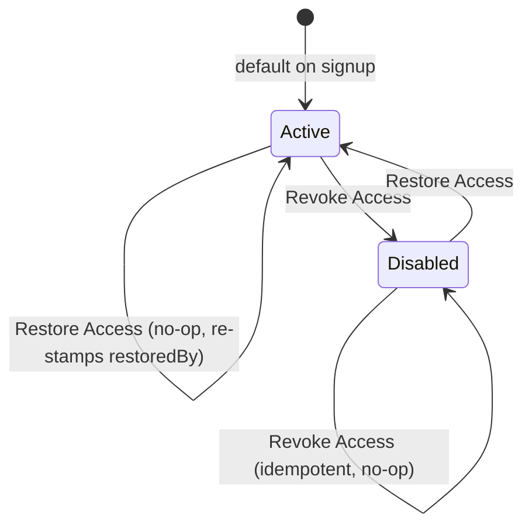
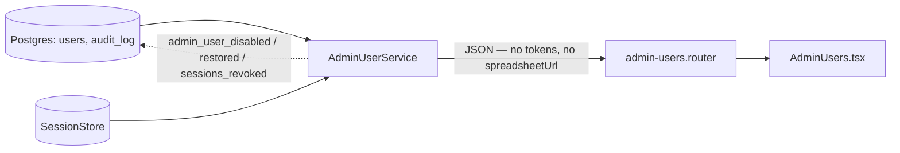
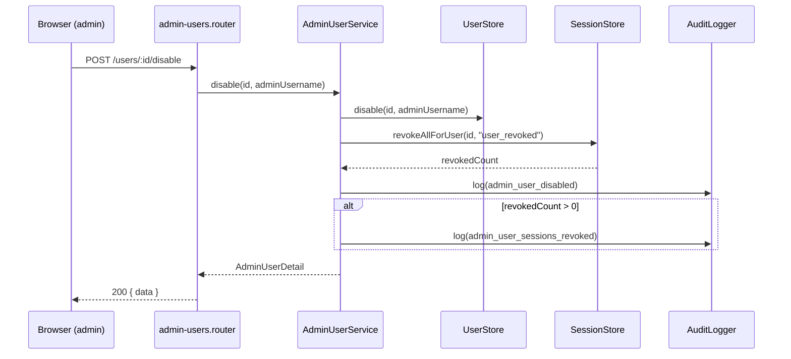

# Admin User Management — Design

## Quick reference

- `GET /api/admin/users`, `GET /api/admin/users/:googleUserId`,
  `GET /api/admin/users/:googleUserId/audit`,
  `POST /api/admin/users/:googleUserId/disable`,
  `POST /api/admin/users/:googleUserId/restore`,
  `POST /api/admin/users/:googleUserId/force-logout`
- Depends on: `UserStore`, `SessionStore`, `AuditLogger` (shared interfaces),
  the `adminAuth` guard (`backend/src/shared/http/admin-auth.ts`) · Provides:
  nothing — leaf module, imported only by `app.ts`.
- Sits behind the same `adminAuth` guard as
  [Admin Authentication](Admin-Authentication.md) — read that one first.
- Implemented in `backend/src/modules/admin-users/`, with `UserStore`/
  `AuditLogger` extensions under `backend/src/shared/`, and the frontend
  under `frontend/src/routes/admin/` + `frontend/src/features/admin/`.

## 1. Purpose & scope

A User Directory (search/filter/sort/paginate + summary stats), a User
Details page (profile, session, spreadsheet title, scan count, audit
history), and three actions: **Revoke Access**, **Restore Access**, **Force
Logout**.

**"Scans"** = `savedContactsCount`, relabeled — the same number the user's
own dashboard shows, not a second metric. M1 uploads are transient and were
never durably counted, so this reuses the one number with a reliable
history.

**Never exposes `spreadsheetUrl`**, only `spreadsheetTitle` — activity
visibility shouldn't mean a live credential into the user's data.

Out of scope: License Management/quotas, bulk actions, account lockout, a
free-text reason field on Revoke/Restore, backfilling pre-deploy audit
history, Analytics/Configuration/Logs nav surfaces. See §9.

## 2. Dependency graph

```mermaid
graph TD
  APP[app.ts] -->|mounts /api/admin/users*| RTR[admin-users.router]
  RTR -->|router.use adminAuth| GUARD[adminAuth guard]
  RTR --> SVC[AdminUserService]
  SVC --> US[UserStore]
  SVC --> SS[SessionStore]
  SVC --> AL[AuditLogger]
  GUARD -.->|reads only| ADMSESS[(admin_session)]
  GUARD -.x|never reads| USESS[c2c_session / req.auth]
  classDef notTouched stroke-dasharray: 5 5;
  class USESS notTouched;
```

Same dependencies as `google-auth`/`google-sheets` (`UserStore`,
`SessionStore`, `AuditLogger`); the one admin-specific addition is
`adminAuth`, which never populates `req.auth`.

## 3. User lifecycle



"Restored" is a transition back to `Active`, not a third state — kept as an
audit *event* (`admin_user_restored`) so it isn't confused with "never
disabled."

| State | Sign in? | Existing session? | M5 save? |
|---|---|---|---|
| **Active** | Yes | Normal lifecycle | Yes |
| **Disabled** | No — `UserDisabledError` (403) at OAuth callback | Force-ended, can't recreate while disabled | No — same error at save gate |

- Disable/restore are both idempotent no-ops on a row already in that state,
  but restore always re-stamps `restoredAt`/`restoredBy` ("last restore
  wins").
- Tokens, contacts, and `savedContactsCount` are untouched by disable — it's
  an access flag, not data deletion. No TTL/auto-restore.

## 4. Audience & threat model

Single operator, same as [Admin Authentication §2](Admin-Authentication.md#2-audience--permissions).
New risk: an action here is destructive to a **user's** access, scoped to
one `googleUserId` — no bulk endpoint, no self-lockout risk (disabling a
user can't touch the admin's own session).

| # | Risk | Defence |
|---|---|---|
| U1 | End user reaches `/api/admin/users*` with `c2c_session` | `adminAuth` reads only `admin_session`; isolated stores |
| U2 | Race: user keeps working past a disable | `disable()` force-revokes sessions synchronously before responding; only the tiny in-flight-request window is accepted |
| U3 | Credential guessing | Inherited from Admin Authentication (bcrypt 12 + 5/15min/IP) |
| U4 | Login-lockout DoS via repeated failures | **Deliberately no account lockout** — one admin operator means a lockout is a self-inflicted DoS; the IP rate limiter is the real defense (reasoned decision, not a gap) |
| U5 | PII leak via `audit_log` or JSON responses | Same field policy as stdout sink; tokens never serialized (tested) |
| U6 | Admin panel used as a doorway into a user's spreadsheet | `spreadsheetUrl` never serialized, only `spreadsheetTitle` |

## 5. Business rules

- **Revoke Access**: sets `disabledAt`/`disabledBy`, force-revokes live
  sessions (`SessionStore.revokeAllForUser(id, "user_revoked")`), blocks
  future sign-in and M5 save via `UserDisabledError`.
- **Restore Access**: clears `disabledAt`/`disabledBy`, stamps
  `restoredAt`/`restoredBy`. No token clearing, no forced re-consent.
- **Force Logout**: same session-revoke primitive as Revoke Access, but
  leaves `disabledAt` untouched — "kick without banning," for a suspected
  compromised device rather than a bad-actor account.
- **Enforcement points** for a disabled user: the OAuth callback (before
  Session Conflict), and the M5 save route (`req.auth.user.disabledAt`,
  free from the session middleware's existing `UserRecord` load). `/status`
  is not separately gated — `disable()` revokes synchronously before
  responding, so the race window is negligible.
- The Session panel polls every 15s while User Details is open (in addition
  to `refetchOnWindowFocus`), since a target user's session can change on
  their own device with nothing on the admin side to trigger a refetch.
- Every account-management action invalidates all three of this user's
  queries — detail, list, **and audit history** (a prior version missed
  audit, leaving a stale panel after a successful action).

## 6. Entities (data model)

No migration tool — `initSchema` (`backend/src/shared/db/init.ts`) runs on
every boot, idempotent (`IF NOT EXISTS` throughout). Add new
columns/tables there, same pattern.

`users` gains `disabled_at`, `disabled_by`, `restored_at`, `restored_by`
(new), plus `created_at`/`last_login_at` (pre-existing, newly surfaced for
the directory's "Registered"/"Last Login" columns). No backfill needed —
`NULL` is the correct default for every pre-existing row.

```sql
ALTER TABLE users ADD COLUMN IF NOT EXISTS disabled_at TIMESTAMPTZ;
ALTER TABLE users ADD COLUMN IF NOT EXISTS disabled_by TEXT;
ALTER TABLE users ADD COLUMN IF NOT EXISTS restored_at TIMESTAMPTZ;
ALTER TABLE users ADD COLUMN IF NOT EXISTS restored_by TEXT;
CREATE INDEX IF NOT EXISTS users_disabled_idx ON users (disabled_at) WHERE disabled_at IS NOT NULL;
```

New `audit_log` table — insert-only, one row per `AuditEntry`:

```sql
CREATE TABLE IF NOT EXISTS audit_log (
  id BIGSERIAL PRIMARY KEY, ts TIMESTAMPTZ NOT NULL DEFAULT now(),
  event TEXT NOT NULL, google_user_id TEXT, admin_username TEXT,
  session_id TEXT, device TEXT, browser TEXT, ip TEXT,
  outcome TEXT, reason TEXT, card_id TEXT, revoked_count INTEGER
);
CREATE INDEX IF NOT EXISTS audit_log_user_ts_idx ON audit_log (google_user_id, ts DESC);
CREATE INDEX IF NOT EXISTS audit_log_ts_idx ON audit_log (ts DESC);
```

`session_id` truncates to 8 chars at the sink — same field policy as the
stdout audit log (no tokens/email/contact data). No FK to `users`: audit
rows must outlive the row they describe, and some failure events never
resolve to a persisted user. Starts empty on deploy — pre-existing activity
has no history (accepted gap, no structured source to backfill from).



## 7. Endpoints

**Auth**: every route needs a live `admin_session`; missing/invalid →
`401 ADMIN_NOT_AUTHENTICATED`. Unconfigured panel → `503
ADMIN_NOT_CONFIGURED` on every route.

**Envelope, `/api/admin/users*` only**: `{ data, meta?: { page: { total,
totalPages, nextCursor, limit } } }`. `meta.page` only on the two list
endpoints. `/api/admin/auth/*` keeps the older un-enveloped shape — not
retrofitted app-wide, since every other route already has a working
`{error, code?}` convention.

**Cursor pagination**: opaque base64url `cursor`, pass back verbatim for
the next page; `nextCursor: null` = last page. `limit` default 20, capped
100. Keyset, not offset — stable under concurrent disable/restore writes
(an `OFFSET` scheme could skip/duplicate a row mid-scroll).

### `/api/admin/auth/*` (un-enveloped — see [Admin Authentication](Admin-Authentication.md))

| Route | Notes |
|---|---|
| `POST /login` | `{username, password}` → `{username}` + cookie. `401 ADMIN_INVALID_CREDENTIALS`, `429` (5/15min/IP), `503` |
| `POST /logout` | Idempotent, always `200 {ok: true}` |
| `GET /me` | `200 {username}` or `401 ADMIN_NOT_AUTHENTICATED` |

### `/api/admin/users*`

**`GET /users`** — directory. Query: `cursor`, `limit`, `search` (email
substring or exact `googleUserId`), `status` (`all`/`active`/`disabled`),
`sortField`/`sortDirection`, `registeredAfter`/`Before`, `lastLoginAfter`.

```json
{ "data": { "users": [{ "googleUserId": "108...", "email": "ada@example.com",
  "spreadsheetTitle": "...", "savedContactsCount": 12, "createdAt": "...",
  "lastLoginAt": "...", "disabled": false, "disabledAt": null,
  "disabledBy": null, "restoredAt": null, "restoredBy": null }],
  "stats": { "total": 42, "active": 40, "disabled": 2, "recentLogins": 5, "totalScans": 613 } },
  "meta": { "page": { "total": 42, "totalPages": 3, "nextCursor": "eyJz...", "limit": 20 } } }
```

`stats` is always global/unfiltered — a dashboard summary shouldn't drift
as the admin filters the table. `totalScans` = `SUM(saved_contacts_count)`.

**`GET /users/:googleUserId`** — same shape plus `activeSession` (`device`,
`browser`, `ip`, `lastActivityAt`, or `null`). `404 USER_NOT_FOUND`.

**`GET /users/:googleUserId/audit`** — cursor-paginated; `entries: []` if
none (not an error). `404 USER_NOT_FOUND`.

**`POST /users/:googleUserId/disable`** — Revoke Access. `200` = full
detail with `disabled: true`. Logs `admin_user_disabled` (+
`admin_user_sessions_revoked` if a session existed). `404 USER_NOT_FOUND`.

**`POST /users/:googleUserId/restore`** — Restore Access. `200` = full
detail with `disabled: false`. Logs `admin_user_restored`. `404
USER_NOT_FOUND`.

**`POST /users/:googleUserId/force-logout`** — `200 {data: {revokedCount}}`.
Logs `admin_user_sessions_revoked` if a session existed. Doesn't touch
`disabledAt`. `404 USER_NOT_FOUND`.



## 8. Inter-module contracts

`AdminUserService` depends only on `UserStore`/`SessionStore`/`AuditLogger`
— same as `google-auth`/`google-sheets`. Only `app.ts` imports
`admin-users`.

**Adding a new admin feature**: mount under `/api/admin` in `app.ts`, call
`router.use(adminAuth)` at the top (guard lives in `shared/http/`, not the
admin-auth module, so it can be applied without importing it).

Two invariants:

- **Never populate `req.auth` from an admin route** — `requireAuth` and
  `createSaveLimiter` read it; doing so would authenticate M5's save as a
  user. Use `req.adminAuth`.
- **`createSessionMiddleware` skips `/api/admin`** — otherwise a revoked
  Google session 401s the admin panel. Pinned by
  `backend/tests/unit/session-middleware.test.ts` in both directions.

## 9. Out of Scope / Roadmap

Source of truth for `AdminDashboard.tsx`'s disabled nav placeholders
(Analytics, Configuration, Logs — greyed out, non-interactive, "Coming
soon," nothing clickable/404ing/fake). Update here first if a phase ships
one.

| Item | Why deferred |
|---|---|
| License Management, quotas, subscriptions | Explicit product decision — no billing concept exists yet |
| Bulk user actions | Every action is scoped to one `googleUserId`; bulk is a real feature (its own confirm-UX, audit shape), not a small add |
| Account lockout | Reasoned decision, not a gap — see §4 U4 |
| Analytics | No usage/engagement metrics surface beyond the directory's stat cards |
| Configuration | No admin-editable runtime config — env vars only, deploy-time |
| Logs | `docker logs` is still the only log viewer; `audit_log` is a step toward this, not a UI for it |
| Free-text reason on Revoke/Restore | Actor is recorded structurally (`disabledBy`/`restoredBy`) — matches the fixed-`reason`-enum convention elsewhere |
| Backfilling pre-deploy audit history | `audit_log` starts empty; no structured source existed to backfill from |

## 10. Implementation Notes

**Audit dual-write** is an architecture-decision change: audit logging used
to be stdout-only (see [ARCHITECTURE.md](../../ARCHITECTURE.md)'s "Audit
logging & metrics"). The User Details page needs queryable per-user
history, which stdout can't serve, so `PgAuditLogger` now writes both
Postgres and stdout.

**Responsive design**: the User Directory table sits in its own
`overflow-x-auto` wrapper rather than letting the page overflow — checked
against a 375px viewport in `admin-users.spec.ts`.
